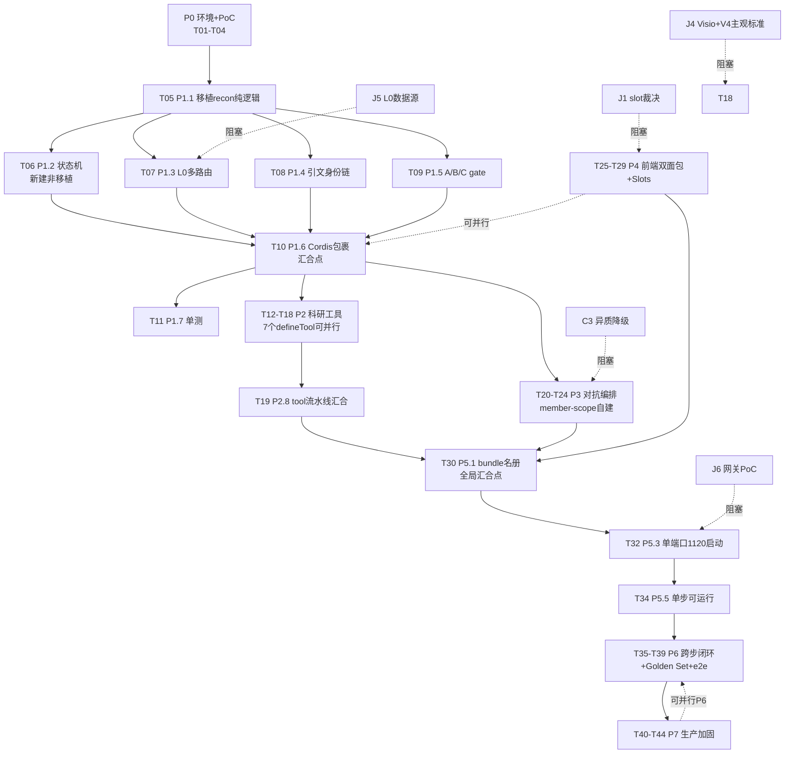
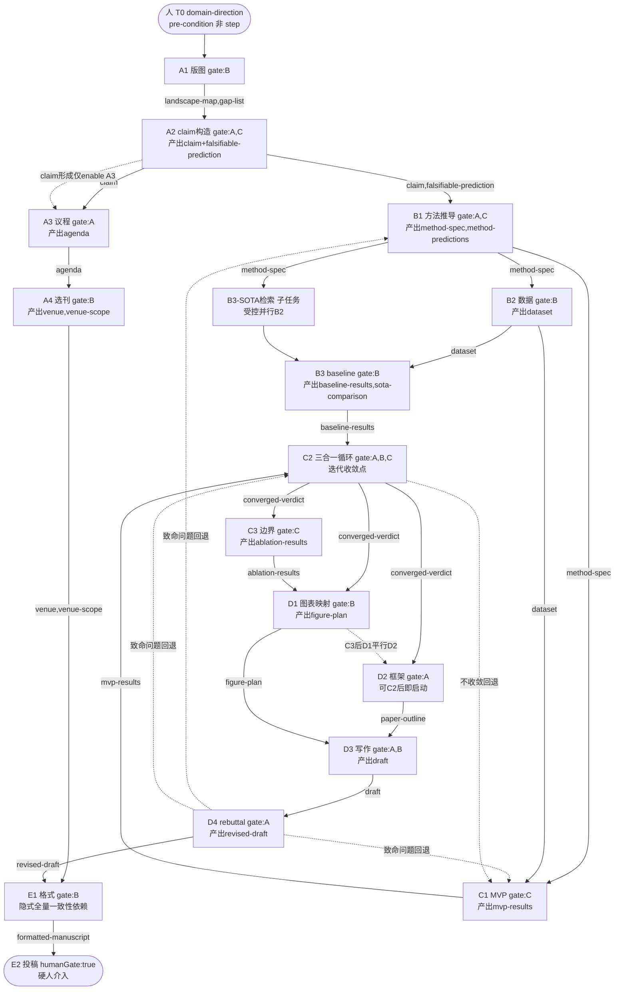
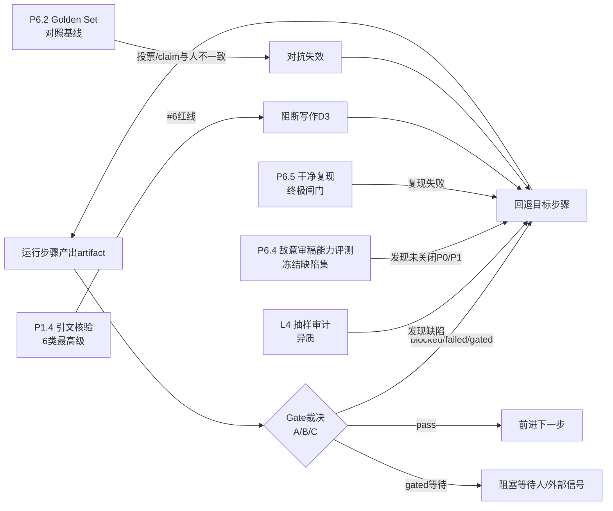

# 05 执行 WBS 与依赖分析（B1）

> 产出方：B1 WBS与依赖 Agent
> 日期：2026-09-02
> 职责边界：基于 A1/A2/A3 已冻结事实基线（`00..04` plan 文件），只读核验，不改任何 DSH 源码或两份设计文档；仅 Write 本 plan 文件。
> 结论格式：结论｜类型｜证据位置｜影响｜建议动作
> 阶段映射：v1.1 §10（P0-P6 落地交付）+ v1.0 §7（P1-P6 方法论验证）+ 本 B1 扩展 P7（生产加固）= 统一 P0-P7。

---

## 〇、关键事实裁定（本 WBS 的地基，均来自已冻结基线）

| 编号 | 结论｜类型｜证据位置｜影响｜建议动作 |
|---|---|
| F-W1 | recon 引擎=纯骨架（steps.ts 16 条 StepDefinition + types.ts 类型），**state-machine.ts 在 steps.ts 注释中被引用但文件不存在**｜源码已验证｜`research-prototype/src/engine/`（仅 steps.ts+types.ts，无 state-machine.ts，package.json 无 test 文件）｜"16 步可建模"成立但"状态机可运行"不成立；骨架覆盖≠跨步闭环可运行｜P1.2 必须实现状态机（非移植，是新建）|
| F-W2 | 1121 辅助服务在 DSH 源码架构上不必要（单端口 webserver 已含 SPA+RPC+WS）｜源码已验证｜`packages/host/webserver/src/index.ts:220-300`（单 server）+ `packages/api/gateway/src/index.ts:223`（WS 注册到 webServer）+ grep `1120\|1121` 仅命中 logo path｜v1.1 §3 双端口设想与源码单端口模型不符｜1121 改为"暂缓/可选"，1120 单端口承载全部；若确需旁路服务走独立进程非 DSH 架构内组件 |
| F-W3 | experimental 子系统（agent-team/code-runtime-python）私有未发布，无稳定性承诺｜源码已验证｜`packages/README.md:52`、`AGENTS.md:48`、03_dsh_evidence §5｜P3 对抗编排不得直接 import experimental agent-team｜member-scope 模型可作设计参考，实现须自建于 `ctx.subagents` + 自有 SessionEventMap 注入之上 |
| F-W4 | pre-release 0.1.2-alpha.4 无兼容承诺，vendored 19 条本地修改须重应用｜源码已验证｜`AGENTS.md:5-11`、`vendor/README.md:29-51`｜升级成本高，on-disk 格式/SessionEventMap 随版本破坏｜P7 版本锁定当前 commit，自研插件只依赖 Service Definition 不触 vendor |
| F-W5 | 非 Git 副本构建须显式导出 DSH_CLIENT_COMMIT_HASH｜源码已验证｜`scripts/client-build-environment.ts:50`、`.dsh-build/client-build-environment.json`（曾用 `0000000` 成功构建）｜CI/部署脚本漏设即 official 构建抛错｜P0 落地脚本固化 `DSH_CLIENT_COMMIT_HASH=0000000` + `DSH_CLIENT_VERSION=0.1.2-alpha.4` |
| F-W6 | conversation.side.panel slot 代码库不存在｜源码已验证｜01_fact_baseline J1｜P4 前端须改真实 slot｜P4.1 先裁决改用 `conversation.view`/`conversation.details` 或新声明子 slot |
| F-W7 | dsh.client **实有 `./client` exports**（v1.1 §7.1 引用正确，ui-skill package.json:21-24 types+default）+ 嵌套 `dsh:{client:{inject,platform}}`｜源码已验证｜01_fact_baseline J2(返工更正)、`ui-skill/package.json:16-27`｜P4 双面包构建以 ui-skill 为模板，无阻断（AUD-01 已纠正原误判） |

---

## 一、三类依赖（§九）

### (1) 方法论依赖：L0-L4 / 判断三件套(A-B-C) / 16 步 / 人工决策

| 方法论层 | 依赖项 | 工程落点 | 依赖来源 | 阻断项 |
|---|---|---|---|---|
| L0 文献质量过滤 | 多类型路由表（11 类文献） | P1.3 | J5 数据源获取（中科院分区/CCF 许可） | J5 未确认 |
| L1 执行 16 步 | 状态机 + 工具 + agent | P1.2(状态机)+P2(工具)+P3(team) | F-W1 状态机不存在 | 状态机实现 |
| L2 判断三件套 A | red-team 反驳 + judge 投票≥2 | P3.2+P3.3 | C3 同族降级（flash/pro 同族非真异质） | C3 待裁决 |
| L2 判断三件套 B | 外部锚（L0/SOTA/复现） | P3.4 | L0(外部文献库)+复现(真实结果) | 外部信号必要非充分(A2降级) |
| L2 判断三件套 C | 可证伪→实验裁决 | P3.5+P2.3 | 复现结果(真值) | 复现成功≠正确(A10降级) |
| L3 闸门 | 每步 gate + StepStatus 回退 | P1.5+P1.2 | recon StepStatus blocked/failed/gated(S14) | 闸门须客观指标非 AI 主观报告 |
| L4 安全网 | 定领域词 + 按投稿键（硬介入=2） | P7.2 | 人提供历史数据外信号 | 软介入多步需权属矩阵(C2) |

**方法论关键路径**：L2 判断层是成败核心（v1.0 §7"P2 必须先于 P3 闸门跑通"）。A 机制受 C3 同族降级制约，须靠异质 prompt + 外部锚(B) 补强，关键认知判断（步骤 9 三合一）保留人领域锚。

### (2) 工程包依赖：dsh-research-core/tools/team/web/bundle + DSH 能力

```
dsh-research-core(纯逻辑+host包裹)
  ├─ dsh-research-tools(ctx.tools.register)         依赖 core host
  ├─ dsh-research-team(ctx.subagents 自建,非experimental) 依赖 core host
  ├─ dsh-research-web(双面包+Slots)                 依赖 J1 slot裁决
  └─ dsh-research-bundle(cordis.patch.yml名册)      依赖上述全部
DSH 复用能力(均源码已验证):
  workflow/(状态机生命周期)·session/(持久+投影)·guard/hooks(执行序)
  code-runtime(worker-thread,非e2b)·web(Slots)·subagent(6 providers)
  external学术数据源(Crossref/OpenAlex/arXiv/Semantic Scholar/Retraction Watch)
  第三方模型网关(deepseek-official+baseURL,OpenAI-compatible)
  可选1121(源码证不必要→暂缓)
```

**工程关键路径**：core(host包裹 P1.6) → tools/team/web(可并行 P2∥P3∥P4) → bundle(P5.1) → startup(P5.3) → 单步可运行(P5.5) → 跨步闭环(P6.1)。

### (3) 16 步运行时依赖（artifact 依赖图，非 1→16 线性）

基于 `steps.ts` 每步 `inputs`（artifact 依赖，决定能否 start）与 `gate`（决定能否 exit）：

| 并行性分析点 | 结论 | 依据（artifact 输入） |
|---|---|---|
| 3∥4 是否 Claim 初步形成后并行？ | **否（串行）**：A4 选刊 inputs 含 A3 的 `agenda` 输出 | A3.inputs=['claim'](来自A2)→outputs['agenda']；A4.inputs=['claim','agenda']。Claim 形成仅 enable A3，A4 须等 A3 的 agenda。受控并行仅限 A4 的 venue-scope 草拟与 A3 重叠 |
| 5-6-7 受控并行边界？ | **5→6 串行，6∥7-SOTA 受控并行**：B2 数据需 B1 的 `method-spec`；B3 baseline 的 `sota-comparison` 子任务只需 `method-spec`（不需 `dataset`），可与 B2 数据清洗并行，B3 退出需 `dataset` | B1→method-spec→B2; B2→dataset→B3; B3-sota-retrieval∥B2 |
| 8-10 实验迭代？ | **8→9→10 串行前向，C2 自带迭代回退**：C2 三合一循环 inputs=['mvp-results','baseline-results']；C2 是迭代收敛点，不收敛可回退调参/补模块 | C1→mvp-results→C2; C2→converged-verdict→C3; C2 内部循环 |
| 11∥12 并行可能？ | **是（C3 完成后并行）**：D1 图表映射 inputs=['converged-verdict','ablation-results']；D2 框架 inputs=['claim','agenda','converged-verdict']。D2 无 ablation 依赖，可在 C2 后即启动（早于 D1），C3 后 D1∥D2 全并行 | D1 与 D2 无交叉 artifact 依赖 |
| 14 致命问题回退 5-10？ | **是**：D4 rebuttal 揭示致命缺陷→回退 B1(方法)/C1-C2(实验) 重做 | D4.inputs=['draft']；rebuttal 发现方法/实验缺陷→rollback |
| 15 一致性依赖？ | **隐式全量依赖**：E1 格式 inputs=['revised-draft','venue','venue-scope']，但"终极闸门"须核验代码(B1/C1)+数据(B2)+表图(D1)+正文(D3)一致性 | E1 退出叠加一致性审计 |
| 16 人工责任边界？ | **硬人介入**：E2 humanGate=true，inputs=['formatted-manuscript']，gate=[] | recon steps.ts E2 humanGate:true |

---

## 二、§十七 WBS 表

> 表头：task_id｜阶段｜任务｜责任角色｜输入｜输出｜前置依赖｜执行方式｜验收方法｜阻断条件｜风险
> 责任角色：IMPL=实现Agent(写代码,因用户不熟TS/pnpm)｜USER=用户(决策/领域词/投稿/API key)｜VERIFY=验证Agent｜ARCH=架构Agent
> 执行方式：串行／可并行／受控并行／阻塞等待

| task_id | 阶段 | 任务 | 责任角色 | 输入 | 输出 | 前置依赖 | 执行方式 | 验收方法 | 阻断条件 | 风险 |
|---|---|---|---|---|---|---|---|---|---|---|
| T01 | P0 | fresh build env：导出 DSH_CLIENT_COMMIT_HASH=0000000+VERSION，pnpm install+build | IMPL | master1 源码+node/pnpm | build artifacts+.dsh-build record | — | 串行 | `pnpm run build` exit 0 + lib/worker.cjs 存在 | 无 | 非 Git 须导出 env(F-W5) |
| T02 | P0 | PoC 网关可调：v4-flash/pro 实端 test:e2e | IMPL+USER | .env(API key) | e2e pass/fail 报告 | T01 | 串行(可并行 T03/T04) | 端点接受 v4-* id 返回 token | J6 网关连通 | 模型名 pass-through，网关可能不认 v4-*(adapter.ts:352) |
| T03 | P0 | PoC picker 崩溃根因：5 只读探针(arm/koffi-load/COM Show/worker.cjs/pointer-size) | IMPL | win32 环境 | 根因报告 | T01 | 可并行 T02/T04 | 定位 native AV vs tsx-load | 无(browse 后端可绕过) | native AV in COM Show(首要候选) |
| T04 | P0 | PoC 全新环境复现构建 | IMPL | 干净环境 | 复现确认 | T01 | 可并行 T02/T03 | 干净 env build exit 0 | 无 | env var 漏设 |
| T05 | P1.1 | 移植 recon 纯逻辑→dsh-research-core/src(纯 TS,不碰 Cordis) | IMPL | recon engine 骨架(steps.ts+types.ts) | research-core 纯逻辑模块 | T01 | 串行 | `tsc --noEmit` pass | 无 | 低(骨架已存在) |
| T06 | P1.2 | **实现状态机**：input 依赖强制+gate 通过+StepStatus 转换(pending→in_progress→gated→passed/blocked/failed)+回退 | IMPL | T05 StepDefinition | 状态机运行时 | T05 | 串行 | 单测：步骤未得 inputs 不可 start；gate fail→blocked/failed；可回退重跑 | 无 | **state-machine.ts 不存在(F-W1)，是新建非移植**；回退语义(D4→B1/C)须设计 |
| T07 | P1.3 | L0 多路由过滤：11 类文献路由表(中科院/CCF/CORE/ISO/官方源/Zenodo/GitHub/ISBN/arXiv标注/经典) | IMPL+USER | J5 数据源 | L0 filter 模块 | T05 | 可并行 T06/T08/T09 | 每类型路由正确；预印本标注未评审 | J5 数据源获取+许可 | 白名单过期/新刊排除(A7降级) |
| T08 | P1.4 | 引文身份链：claim_id→citation_id→原文证据→定位→核验方式→结论；6 类最高级问题(#6 未访问原文却声称核验=系统红线) | IMPL | Crossref+Retraction Watch API | 引文核验纯函数 | T05 | 可并行 T06/T07/T09 | 6 类拦截；#6 红线触发即阻断 | J5(DOI 源) | 原文访问需专项 agent(非仅元数据) |
| T09 | P1.5 | A/B/C gate 纯函数：A(red-team+judge vote≥2)+B(外部锚)+C(可证伪→实验) | IMPL | T05 | gate 纯函数 | T05 | 可并行 T06/T07/T08 | gate 产出 GateVerdict；投票弃权阈值 | C3 同族降级确认 | same-family 对抗局限(A4降级) |
| T10 | P1.6 | Cordis 三件套包裹：name/inject/Config/apply+服务声明(declare module) | IMPL | T06+T07+T08+T09 | dsh-research-core Cordis 插件 | T06,T07,T08,T09 | 阻塞等待(汇合) | `dsh web` 加载插件成功 | 无 | pre-release API rename(F-W4) |
| T11 | P1.7 | 单元测试：状态机+gates+L0+引文(vitest) | IMPL | T06,T07,T08,T09 | test suite | T10 | 串行 | `vitest run` pass | 无 | 低 |
| T12 | P2.1 | research_literature_scan：Crossref+OpenAlex+arXiv+Semantic Scholar+L0 | IMPL | T10+外部 API | defineTool 注册 | T10 | 可并行 T13-T18 | 工具可调用，返回 L0 过滤文献 | 无 | API rate limit |
| T13 | P2.2 | research_citation_verify：完整身份链+撤稿核验 | IMPL | T08+T10 | defineTool | T10 | 可并行 | 6 类拦截 | 无 | 原文访问 |
| T14 | P2.3 | research_claim_construct + falsify_check | IMPL | T10 | defineTool×2 | T10 | 可并行 | claim→可证伪预测 | 无 | AI 换皮 claim(A3降级) |
| T15 | P2.4 | research_ablation_predict | IMPL | T10 | defineTool | T10 | 可并行 | 消融预测可证伪 | 无 | 低 |
| T16 | P2.5 | research_figure_render：matplotlib+SciencePlots，SVG+PNG，code-runtime worker-thread | IMPL | T10+code-runtime | defineTool+SVG/PNG | T10 | 可并行 | SVG 矢量+PNG+色盲友好+单位+字号 | SciencePlots TS 等价物决策 | Python subprocess vs TS 复刻 |
| T17 | P2.6 | research_table_threeline：pandas.to_latex+booktabs | IMPL | T10+code-runtime | defineTool+LaTeX | T10 | 可并行 | booktabs 三线+有效数字统一 | 无 | 低 |
| T18 | P2.7 | research_roadmap_render：Visio/mermaid/drawio/excalidraw | IMPL+USER | T10+Visio A/B 决策 | defineTool+矢量图 | T10 | 可并行(但受 J4/V4 阻塞) | 不看正文懂方法主线(V4 主观) | J4 Visio 复用确认+V4 主观标准裁决 | AI 最弱图类；主观验收 |
| T19 | P2.8 | tool 流水线集成：pre-execute→guard→execute→post-execute→result | IMPL | T12-T18 | 集成工具 | T12,T13,T14,T15,T16,T17,T18 | 阻塞等待(汇合) | 工具走 DSH 流水线+timeout-policy | 无 | 超时策略 |
| T20 | P3.1 | member-scope 自建：write-scope+CAS 修订+owner 认领(基于 ctx.subagents,**非 experimental**) | IMPL | T10+ctx.subagents | team 协调模块 | T10 | 串行 | member write-scope 强制 | 无 | 不能依赖 experimental(F-W3) |
| T21 | P3.2 | red-team agent fleet：异质 prompt(多角色/流派) | IMPL | T20 | red-team agents | T20 | 串行 | 多流派反驳 | C3 已裁决(D12)：同族模型+persona/prompt 差异化+外部锚，效果待 Golden Set 验证 | same-family 局限 |
| T22 | P3.3 | judge vote(≥2 to keep)+弃权阈值 | IMPL | T21 | vote+abstain | T21 | 串行 | vote≥2 pass；不一致弃权 | Golden Set(验证用) | 同源互投=变相自评(A9降级) |
| T23 | P3.4 | B 外部锚集成：L0+SOTA+复现 | IMPL | T07+T20 | B anchor 模块 | T20 | 可并行 T21 | 对照外部真值 | 无 | 外部信号必要非充分(A2降级) |
| T24 | P3.5 | C 可证伪→实验裁决集成 | IMPL | T09+T20 | C gate 模块 | T20 | 可并行 T21 | 软判断→可证伪→实验裁决 | 无 | 复现成功≠正确(A10降级) |
| T25 | P4.1 | slot 裁决：核验真实 conversation slots，选 conversation.view/details/新子 slot | IMPL+USER | DSH ui-slots 源码 | slot 决策 | 无(可并行 P1) | 串行 | slot 名真实存在(SlotMap) | J1 用户确认 | 文档 slot 假设(F-W6) |
| T26 | P4.2 | 双面包插件：node ESM+browser CJS factory，clientBundle lazy-CJS | IMPL | T25 | 双面包插件 | T25 | 串行 | clientBundle build pass+purity gate | J2 已解除(AUD-01 证伪，./client exports 一致准确；以 ui-skill 为模板，DEC-002) | lazy-CJS 复刻 |
| T27 | P4.3 | Web Slots 注册：research.pipeline/figure/table/roadmap/gate/adversarial(declaration merging) | IMPL | T26 | 已注册 slots | T26 | 串行 | slots 渲染 | 无 | slot kind/scope |
| T28 | P4.4 | 科研工作台 UI：pipeline 进度+figure 预览+gate 面板+对抗面板 | IMPL | T27 | workbench UI | T27 | 串行 | UI 交互 | 无 | 低 |
| T29 | P4.5 | 人介入 UI：approval+ask-user(定领域+投稿，interaction/) | IMPL | T28 | interaction UI | T28 | 串行 | 人介入渲染 | 无 | 低 |
| T30 | P5.1 | bundle 名册：cordis.patch.yml(5 research 包+DSH 能力) | IMPL | T10,T19,T24,T29 | bundle patch | T10,T19,T24,T29 | 阻塞等待(汇合) | `dsh web` 加载全部 | 无 | pre-release rename(F-W4) |
| T31 | P5.2 | source-overlay dev 模式：零 per-plugin 构建(inspector 模板) | IMPL | T30 | dev workflow | T30 | 可并行 T32 | 改 TS 即生效 | 无 | tsx loader 解析 |
| T32 | P5.3 | 单端口 1120 启动(--port 1120，**非 1121** per F-W2) | IMPL | T30+J6 | running instance | T30 | 串行 | http://127.0.0.1:1120 可访问 | J6 网关连通 | 1121 非必要(单端口模型) |
| T33 | P5.4 | LLM 配置：deepseek-official+v4-flash/pro+gateway baseURL(.env+cordis.yml) | IMPL+USER | T02+T32 | LLM 连接 | T32 | 串行 | dsh web 连网关响应 | J6 网关连通 | provider 名/baseURL 路径 |
| T34 | P5.5 | 单步可运行验证：每步可独立调用产出真实 artifact | IMPL+VERIFY | T32+T33 | 16 步单步验证报告 | T33 | 串行 | 每步可独立调用+产出 artifact | 无 | **骨架≠完成**(区分见 §四) |
| T35 | P6.1 | 跨步闭环：状态机多步序列+gate 回退可运行 | IMPL | T06+T34 | closed-loop runtime | T34 | 串行 | 多步序列+gate 回退可运行 | T06 状态机 | 回退语义复杂 |
| T36 | P6.2 | Golden Set 定义：人工标注 claim 集+baseline | USER+VERIFY | 领域专业知识 | Golden Set | T35 | 串行 | 标注 claim 集+基线 | 无标注人/基线 | Golden Set 来源未定 |
| T37 | P6.3 | e2e 验证：已知答案小方向全流程跑+人对照审计 | VERIFY+USER | T35+T36 | 验证集报告 | T36 | 串行 | Golden Set 17 指标达冻结阈值(G18)+15 反例全 blocked+正例通过率达冻结阈值【v1.1 更正：删"经得起敌意审稿"主观验收,替 G18 冻结三项通过条件】 | Golden Set | 直铺联调失败难定位(A6降级) |
| T38 | P6.4 | 敌意审稿能力评测 | VERIFY | T37 | review report | T37 | 串行 | 在冻结审稿缺陷集上评测 P0/P1 缺陷召回率+无依据质疑率+误报率+证据定位完整率+弃权准确性；阈值由 G17 校准后冻结；发现未关闭 P0/P1 问题则阻断后续发布；不得将审稿 Agent 未提出异议解释为 Claim 已被证明【v1.1 更正：删"claim 经得起追问"主观验收,替敌意审稿能力评测（不复制 G18,与 T37 互补）】 | 无 | AI 审稿同源 |
| T39 | P6.5 | 干净环境复现核心结果(终极闸门,必要非充分) | VERIFY | T37 | repro report | T37 | 可并行 T38 | 干净环境复现核心结果 | 无 | 复现成功≠正确(A10降级) |
| T40 | P7.1 | 错误恢复+回退：blocked/failed/gated→retry/rollback | IMPL | T35 | recovery module | T35 | 可并行 P6 | 故障自动回退 | 无 | 复杂回退路径 |
| T41 | P7.2 | L4 安全网流程化：定领域+投稿=2 硬人介入+checklist | IMPL+USER | T29+T35 | run manual | T35 | 可并行 P6 | 人介入点≤2 硬+流程化 | 无 | 软介入多于 2(C2) |
| T42 | P7.3 | loop 政策评估：仅当 3 层无法注入才动 loop(+Agent Note+architecture.md) | IMPL+ARCH | T35 | loop 决策 | T35 | 可并行 P6 | loop 不改或 Agent Note | 无 | 动 loop 成本高(X6) |
| T43 | P7.4 | 版本锁定：0.1.2-alpha.4+vendored commits+experimental 隔离(disabled:!!js) | IMPL | T30 | locked manifest | T30 | 可并行 | experimental 禁用 | 无 | 升级 19 条 local mod(F-W4) |
| T44 | P7.5 | 可观测性：Langfuse+OpenLLMetry+telemetry redactor | IMPL | T35 | observability | T35 | 可并行 | trace 树+评测 | 无 | 低 |

---

## 三、关键路径

**工程关键路径（最长链）**：
`T01(P0) → T05(P1.1) → T06(P1.2) → T10(P1.6) → T19(P2.8) → T30(P5.1) → T32(P5.3) → T34(P5.5) → T35(P6.1) → T37(P6.3)`

**可并行窗口**（缩短关键路径）：
- P0 三 PoC（T02∥T03∥T04）可并行
- P1 子模块（T06∥T07∥T08∥T09）可并行（均依赖 T05，汇合于 T10）
- P2 七工具（T12-T18）可并行（均依赖 T10，汇合于 T19）
- P3 三件套（T21 ∥ T23∥T24）受控并行（均依赖 T20）
- P4 可与 P2∥P3 并行（T25-P4.1 仅依赖 slot 裁决，不依赖 core host）
- P6.4 敌意审稿(T38) ∥ P6.5 干净复现(T39) 可并行
- P7 全部(T40-T44)可并行 P6

**方法论关键路径**：
L2 判断层（P3）须先于 L3 闸门跑通（v1.0 §7）。但 C3 同族降级是阻断——A 机制有效性依赖用户裁决是否接受"同族+异质 prompt+外部锚"或引入跨族模型。

**结论｜类型｜证据位置｜影响｜建议动作**：
方法论 A 机制受 C3 同族降级阻断，是端到端科研有效性的关键路径瓶颈｜待裁决冲突｜01_fact_baseline 冲突 3｜若用户不接受降级方案，须引入跨族外部模型，但用户限定 DeepSeek 网关(D8)｜先以"差异化配置(flash轻量/pro重量)+异质 prompt+外部锚(L0/复现)"三重补强启动，P6 Golden Set 量化验证对抗有效性，不达标再引入跨族

---

## 四、质量阶梯（不得把 16 空壳 agent 当 16 步完成）

| 阶梯 | 定义 | 对应 WBS 退出标准 | 当前状态 |
|---|---|---|---|
| ① 骨架覆盖 | 16 StepDefinition 存在+Trinity gate 定义+StepStatus 类型 | P1.1(T05) tsc pass | **已完成**（recon steps.ts+types.ts，但 state-machine.ts 不存在） |
| ② 单步可运行 | 每步有 Cordis 包裹+工具+agent，可独立调用产出真实 artifact | P5.5(T34) 每步单步验证 | 未开始（状态机+工具+team 待建） |
| ③ 跨步闭环可运行 | 状态机执行多步序列+gate 回退可运行 | P6.1(T35) closed-loop | 未开始（状态机是新建非移植，F-W1） |
| ④ 科研有效性通过 | Golden Set+baseline+敌意审稿能力评测通过 | P6.3-P6.5(T37-T39) | 未开始（Golden Set 未定义，10 主张均降级待验证） |
| ⑤ 生产级质量通过 | 错误恢复+硬化+可观测+版本锁定 | P7(T40-T44) | 未开始（pre-release 无兼容承诺，F-W4） |

**结论｜类型｜证据位置｜影响｜建议动作**：
recon 骨架(steps.ts)仅达阶梯①，state-machine.ts 不存在致阶梯②③须新建｜源码已验证｜`research-prototype/src/engine/`(无 state-machine.ts)｜"16 步可建模"≠"16 步可运行"；骨架覆盖≠跨步闭环｜P1.2 状态机是阶梯②→③的关键新建任务，非移植

---

## 五、成本风险评估：骨架一次铺开+关键能力分阶段深化 vs 全步骤同时到生产级

| 维度 | 骨架一次铺开+分阶段深化（推荐） | 全步骤同时到生产级（不推荐） |
|---|---|---|
| 风险等级 | **低** | **高** |
| 依据 | recon 骨架已存在(阶梯①)，证明可分解；每步 gate 是增量验证点(冲突1裁决：直铺≠无验证)；P1-P6 分阶段(开发期)与运行时全铺(冲突1)不矛盾 | pre-release DSH 无兼容承诺(F-W4)；experimental 不稳定(F-W3)；19 条 vendored local mod；无 Golden Set 基线(10 主张降级)；全硬化后再验证方法论核心会浪费于可能需重设计的步骤 |
| 成本 | 骨架覆盖快(P0-P5 单步)，关键能力(C2 三合一/引文链/6.3 路线图/Golden Set)在 P6-P7 深化 | 全步骤生产级需先建 Golden Set 否则硬化无基准；pre-release 升级会破坏已硬化代码 |
| 回退 | 每步 gate(StepStatus blocked/failed/gated)可回退重跑(S14) | 全生产级后发现问题回退成本极高 |
| 与文档一致性 | 符合 v1.0 §7(P1 骨架先)+v1.1 §10(P0-P6 分阶段)+冲突1裁决(直铺=运行时全铺+内置 gate) | 违反 v1.0 §7"P1 骨架先于 P2 判断层"原则 |

**结论｜类型｜证据位置｜影响｜建议动作**：
推荐"骨架一次铺开(P0-P5 达单步可运行)+关键能力分阶段深化(P6 闭环/Golden Set，P7 生产加固)"｜成本风险评估｜recon 骨架已存在(阶梯①)+冲突1裁决(直铺≠无验证)｜全生产级同时推进会浪费于 Golden Set 未验证前硬化的步骤，且 pre-release 升级破坏风险高｜按阶梯②→③→④→⑤ 逐级深化，C2 三合一/引文身份链/6.3 路线图列为 P6-P7 攻坚优先级(沿用 v1.0 §7"6.3 最难单独攻关")

---

## 六、三个 Mermaid DAG

### DAG 1：工程实施依赖 DAG



### DAG 2：16 步运行时 DAG（artifact 依赖，非 1→16 线性）



> 注：3∥4 串行（A4 需 A3 的 agenda）；5→6 串行，6∥7-SOTA 受控并行；8→9→10 串行+C2 迭代回退；11∥12 并行（C3 后）；14 回退 5-10；15 隐式全量一致性；16 硬人介入。

### DAG 3：测试-审计-返工闭环



> 闭环核心：gate 不达标(blocked/failed/gated)→回退重跑(S14 StepStatus 可回退)；L4 抽样审计/e2e 敌意审稿/干净复现三重兜底发现缺陷→回退；引文 #6 红线(未访问原文却声称核验)→阻断写作。

---

## 七、第一批可立即执行任务

| task_id | 任务 | 为何可立即执行 | 依赖状态 |
|---|---|---|---|
| T01 | fresh build env（导出 env+pnpm install+build） | 无外部依赖，逃生口已验证(F-W5) | 无阻断 |
| T05 | 移植 recon 纯逻辑→dsh-research-core/src | 骨架已存在(steps.ts+types.ts)，纯 TS 不碰 Cordis | 依赖 T01 |
| T06 | 实现状态机 | 骨架已定义 StepDefinition(inputs/outputs/gate)，state-machine.ts 待新建 | 依赖 T05 |
| T25 | slot 裁决（核验真实 conversation slots） | 只读核验 DSH ui-slots 源码，不依赖 core | 无阻断（J1 待用户确认但核验可先做） |
| T03 | picker 崩溃根因 PoC | 5 只读探针，不依赖网关 | 依赖 T01 |
| T04 | 全新环境复现构建 PoC | 逃生口机制已确认 | 依赖 T01 |

> T02（网关 PoC）需用户提供 DEEPSEEK_API_KEY，列为"待用户提供 key 后立即执行"。

---

## 八、暂缓项

| 项 | 暂缓原因 | 解封条件 |
|---|---|---|
| 1121 辅助服务 | 源码证单端口(1120)已含 SPA+RPC+WS，1121 非必要(F-W2) | 确需旁路服务（矢量渲染 worker/复现包托管）且单端口不足时，走独立进程 |
| 生产级硬化全部 16 步(P7) | 须先过 P6 Golden Set 验证，否则硬化无基准（10 主张降级） | P6.3 e2e 验证通过 |
| loop 修改(P7.3 T42) | 默认不改(X6)，仅当 3 层(插件>guard/hooks>状态机)都无法注入时才动 | 验证某科研判断强制注入点落在 agent turn 内部相位且前三层无法插入 |
| Visio ai 绘图 skill 复用(J4) | 待搜索确认，有 vsdx fallback 不阻塞 | 搜索到可用项目或确定走 vsdx/mermaid |
| SciencePlots TS 等价物 | 纯 TS 科研图表风格库无成熟方案 | 决策 subprocess Python vs TS 复刻样式 token |

---

## 九、明确不做项

| 编号 | 不做项 | 依据 |
|---|---|---|
| X1 | 不用 e2b（本地 code-runtime worker-thread） | D2 + S15 |
| X2 | 绘图不输出 PDF（SVG+PNG） | D4 |
| X3 | 不做垂直切片 MVP（完整 16 步直铺） | D3（运行时全铺，开发期分阶段） |
| X4 | 不开鉴权/多租户/并发 | D7 |
| X5 | 不做范式级开创性工作（v1.0 §10.1 范围声明）【v1.1 更正：删"数学边界"无证据表述】 | v1.0 §10.1 |
| X6 | 默认不改 loop（动则 Agent Note+architecture.md） | D10 |
| X7 | 不另起前端项目（嵌入 DSH apps/web） | D9 |
| X8 | 不直接 import experimental 包（agent-team/code-runtime-python） | F-W3 隔离建议 |
| X9 | 不硬编码 1120/1121（端口走 Config/port 旗标） | webserver Config schema |
| X10 | 不依赖 deepseek-v4-* 一定可调（须 PoC） | adapter.ts:352 pass-through |

---

## 十、待用户裁决项

| 编号 | 裁决项 | 影响 | 建议 |
|---|---|---|---|
| U1 | C3 异质模型降级：接受"同族(flash轻量/pro重量)+异质 prompt+外部锚"三重补强，或引入跨族外部模型？ | P3 对抗有效性（A 机制）｜阻断科研有效性关键路径 | 先接受降级方案启动，P6 Golden Set 量化验证，不达标再引入跨族 |
| U2 | C4 L0 多体系路由：11 类文献类型路由表是否采纳？ | P1.3 L0 过滤 | 采纳（双领域+多文献类型不能一刀切分区表） |
| U3 | J1 conversation slot：改用 conversation.view / conversation.details / 新声明子 slot？ | P4 前端 | 建议核验后选 conversation.view 或 details（真实存在） |
| U4 | R18/V4 路线图验收标准："不看正文懂方法主线"为主观标准，接受人裁决或定义可操作化替代指标？ | T18 roadmap 验收 | 接受人裁决（V4 不可操作化）+ 辅以层级清晰/无冗余/矢量等可检项 |
| U5 | J5 L0 数据源获取：中科院分区表/CCF 目录获取与许可？ | P1.3 L0+P1.4 引文闸门 | 用户确认数据源可得性+许可 |
| U6 | Visio A/B 决策：J4 搜索结果确定 Visio vs vsdx vs mermaid？ | T18 roadmap_render | 待搜索；fallback vsdx 已确定可用 |
| U7 | Golden Set 来源：谁标注 claim 集+baseline？ | P6.2 科研有效性验证 | 用户/领域专家提供已发表顶刊论文集作成功基线 |

---

## 十一、阻断项（blockers）

| 编号 | 阻断项 | 阻断任务 | 解法 |
|---|---|---|---|
| B1 | J6 第三方网关连通性（ai.ctaigw.cn base_url+provider 名） | T02/T32/T33 LLM 连接 | 用户提供 key 后跑 PoC；provider 名先试 deepseek-official |
| B2 | C3 同族降级未裁决 | P3 对抗有效性+科研有效性关键路径 | 用户裁决 U1 |
| B3 | J5 L0 数据源未获取 | T07 L0+T08 引文闸门 | 用户确认 U5 |
| B4 | F-W1 状态机不存在 | T06/T35 阶梯②③ | P1.2 新建状态机（非移植） |
| B5 | J1 slot 未裁决 | T25-T29 P4 前端 | 用户裁决 U3（核验可先做） |
| B6 | Golden Set 未定义 | T36-T39 P6 科研有效性 | 用户/领域专家提供 U7 |
| B7 | J4/V4 路线图主观验收 | T18 roadmap_render | 用户裁决 U4+U6 |

---

## 十二、待回答问题（openQuestions）

1. 网关 `ai.ctaigw.cn` 的 base_url 是 `/v1` 还是根路径？provider 名 `deepseek-official` 是否被网关接受？（PoC T02 待 key）
2. recon 状态机的回退语义（D4→B1/C1/C2 跨阶段回退）如何与 DSH workflow 中断恢复（bounded disposal+exactly-once end）协调？需在 T06 设计。
3. 同族(flash vs pro)+异质 prompt 的对抗，错误去相关性是否足以支撑 A 机制"judge vote≥2"？须 Golden Set 量化（T36）。
4. 网关是否接受 DeepSeek 专属头（x-deepseek-harness-user-id 等）？不接受则 extensions.accept 失败影响 telemetry 不影响主对话（adapter.ts:531）。
5. SciencePlots 走 Python subprocess 还是 TS 复刻样式 token？影响 T16 的运行时依赖（是否需 Python 环境）。
6. 1120 单端口在矢量渲染 worker（若保留）+复现包托管场景下是否真够用？F-W2 证单端口架构成立但未压力验证重旁路负载。
7. experimental agent-team 的 mailbox/DAG/write-scope 模型自建于 ctx.subagents 时，CAS 修订+持久化经 SessionEventMap 注入是否能复现其 durable 语义？（T20 设计验证）
8. L0 白名单更新机制——中科院分区表/CCF 目录会过期，系统无白名单更新机制（A7降级）如何持续维护？

---

## 附：文件路径索引（绝对路径）

- 本文件：`D:\1\plan\05_execution_wbs.md`
- 冻结基线：`D:\1\plan\00_source_manifest.md` / `01_fact_baseline.md` / `02_requirement_traceability.md` / `03_dsh_evidence.md` / `04_reuse_candidates.md`
- recon 骨架：`D:\1\deepseek-harness-master1\deepseek-harness-master\research-prototype\src\engine\steps.ts`（16 步定义）/ `types.ts`（StepDefinition+StepStatus）
- 状态机缺失证据：`research-prototype/src/engine/` 仅含 steps.ts+types.ts（无 state-machine.ts，steps.ts:14 注释引用但不存在的文件）
- 单端口证据：`D:\1\deepseek-harness-master1\deepseek-harness-master\packages\host\webserver\src\index.ts:220`
- 构建逃生口：`D:\1\deepseek-harness-master1\deepseek-harness-master\scripts\client-build-environment.ts:50`
- 设计文档：`D:\1\1.科研论文生产系统_DSH插件落地方案_v1.1.md`（§10 P0-P6）/ `D:\1\1.AI科研论文生产系统设计文档_v1.0.md`（§7 P1-P6）
