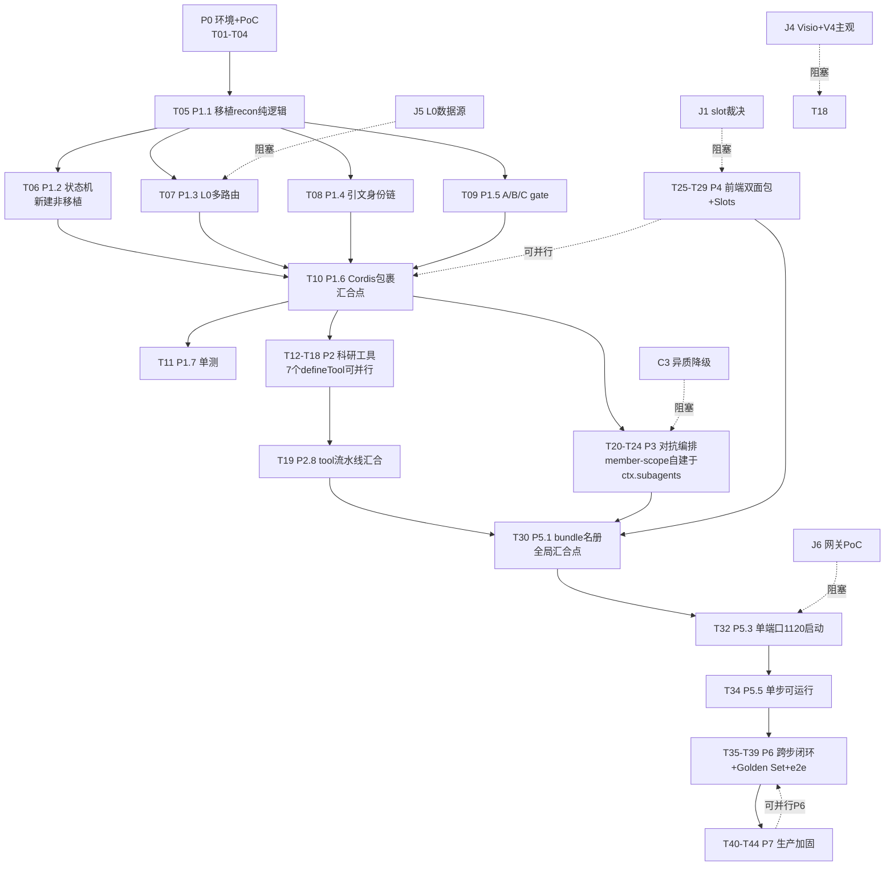
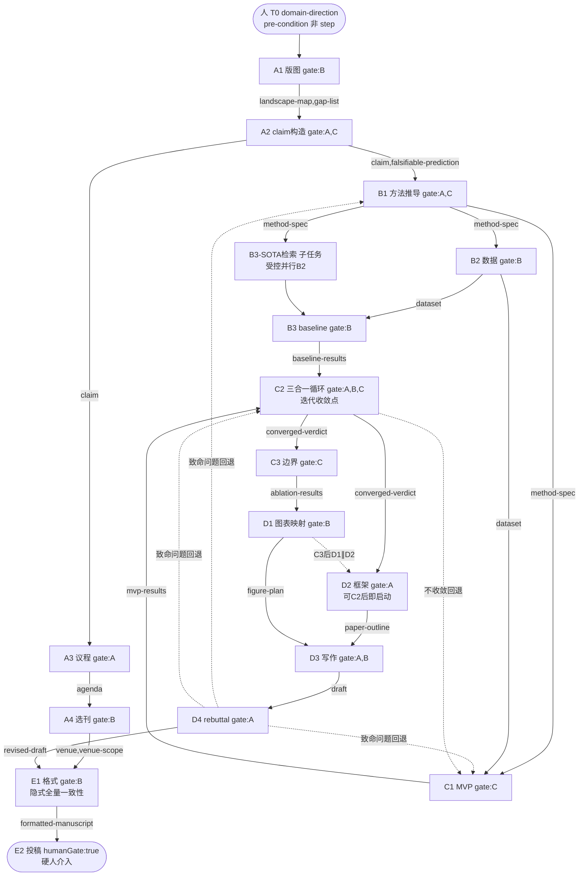
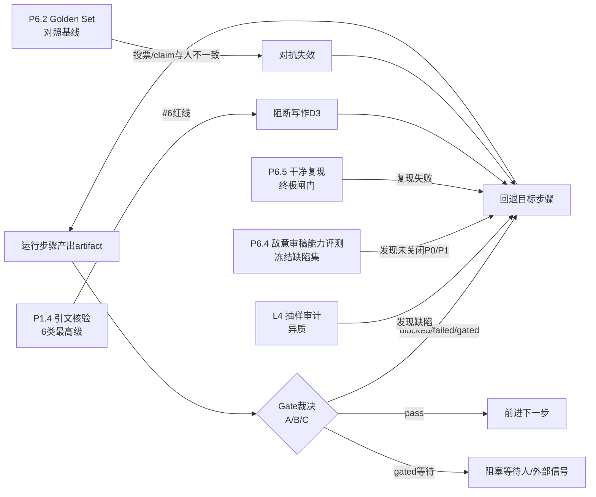

# AI 科研论文生产系统 · 最终执行计划（final_execution_plan）

> 主 Agent（系统架构负责人 / 计划编排负责人）单一最终写入者。
> 融合产物：`plan/00..07`（返工第 1 轮已更正 AUD-01；**v1.1 二次修订已更正 5 项 + 录入 D12-D19**）+ dsh-multiagent-recon 旁证 + 主 Agent Gate A 独立复核。
> 计划版本：**v1.1**（2026-09-02 二次修订：用户裁决 U1-U8 → D12-D19 + 5 项更正 + 目录选择器有限修复授权；差异清单见 `plan/v1.1_diff_list.md`）｜ 日期：2026-09-02 ｜ DSH 冻结版本：`0.1.2-alpha.4`（pre-release）｜ 授权边界：只读分析（不改 DSH 源码、不改两份设计文档、不装依赖、不引第三方仓库、不联网用真 key）；**例外**：目录选择器 bug 经用户 2026-09-02 有限授权可修（范围仅目录选择器及必要降级链路，须先 T03 只读探针 + 稳定复现 + 失败回归测试，不得借机重构其他 DSH 模块）。
> 证据优先级（本次采用）：① 用户已确认决策 > ② 本地 DSH 源码+测试 > ③ DSH 官方文档+仓库 > ④ 两份设计文档技术描述 > ⑤ 其他项目官方文档+源码 > ⑥ Agent 工程推断。文档↔源码冲突 → 记「产品需求—当前能力差距」，给适配/替代/影响，不推翻产品目标。

---

## 开篇 5 项（指令 §最终交付要求）

### 1. 文件和源码可访问性
- ✅ 两份设计文档完整可读：`1.科研论文生产系统_DSH插件落地方案_v1.1.md`（285 行）、`1.AI科研论文生产系统设计文档_v1.0.md`（257 行）。
- ✅ DSH 源码副本可访问：`D:\1\deepseek-harness-master1\deepseek-harness-master`，版本 `@deepseek-ai/dsh-root 0.1.2-alpha.4`（`package.json:3`）。AGENTS.md + docs/architecture.md + docs/capability-seams.md + 多处 src/lib 已核验。
- ✅ `awesome-dsh-plugin-main`：2937 条社区插件目录（22 类）+ ui-ux-pro-max skill。
- ✅ `research-prototype/src/engine/`：recon 纯逻辑引擎（steps.ts 185 行 + types.ts 74 行，tsc strict clean）；**但 state-machine.ts 不存在**（steps.ts:14 注释引用但文件缺失）。
- ✅ 环境：node v24.18.0 / pnpm 11.21.0；`pnpm install + build` exit 0（逃生口 `DSH_CLIENT_COMMIT_HASH=0000000` + `DSH_CLIENT_VERSION=0.1.2-alpha.4`，`.dsh-build/client-build-environment.json` 证 220 artifacts）。
- ⚠️ **1 处降级**：`github.com` WebFetch 被网络策略阻断 → 16 外部 OSS + 16 DSH 社区插件的 LICENSE 全文/最近提交/issue 活跃度标「待 web 核验」，地址经 WebSearch 确认存在，未编造。

### 2. 实际启用的子 Agent 及其任务
- **research-paper-execution-plan 工作流**（`ws7oxakj5`，6 agents / 0 错误 / 180k tokens）：Batch A 并行 ≤3 — A1 文档与需求（写 00/01/02）· A2 DSH 源码核验（写 03）· A3 开源复用调研（写 04）；Batch B 并行 ≤2 — B1 WBS+依赖（写 05）· B2 测试+Golden Set（写 06）；Batch C — C 独立审计（写 07）。
- **dsh-multiagent-recon 工作流**（`w37lte33t`，21 agents / 0 错误 / 565k tokens）：6 路本地源码深读（subagent/workflow/preset/slots/composition/python）+ 3 路网络调研 + 链接核验 → 旁证喂入 03/04 与本计划。⚠️ 该工作流 1 子 agent「官方文档站点核验」安全分类器不可用 → 官方文档站点证据留「文档声明未确认」；官方仓地址以源码内泄露（UTF16 fix note）的 `github.com/deepseek-ai/deepseek-harness` 为准（社区 fork `ericcaiwx-star/deepseek-harness`）。
- 主 Agent：Gate A 冻结事实基线 + 独立复核高赌注项（1121 不必要经 grep 独立确认；J2 经直读 ui-skill/package.json:21-24 独立复验）+ 返工第 1 轮执行 + 本文件单一写入。

### 3. 当前发现的阻断项
| id | 级别 | 项 | 处置 |
|---|---|---|---|
| B-PICK | P0 运行时 | 目录选择器「worker exited before reporting」（throw `win32-dialog.ts:155`，COM 子进程 via koffi，无 fallback tier）— 阻塞建工作区 | **用户 2026-09-02 已有限授权修复**：须先完成 T03 五只读探针 + 稳定复现 + 补失败回归测试，再修根因；修复范围仅目录选择器及必要降级链路，不得借机重构其他 DSH 模块；保留 `host-directory-picker-browse` 作降级；修复后须完成 Windows 回归 / 取消选择 / 非法路径 / 子进程异常 / 降级路径测试。**修复未完成前运行环境 B-PICK 阻断仍在（不因规划审计改判通过而消失）** |
| B-KEY | P0 安全 | 真实 key 曾在对话暴露（文档一律用 sk-xxx 占位，不得出现任何真实片段） | **用户 2026-09-02 确认自行轮换**；新密钥提供前 T02 不执行；任何文件（代码/日志/Fixture/计划）只用 `sk-xxx` 占位；.env + .gitignore + ctx.credentials CredentialRef |
| B-L0 | P1 数据 | L0 白名单（中科院分区交通 + CCF 计算机）获取与许可未确认（J5/R69） | A3 调研开放数据源（Crossref/OpenAlex/arXiv CC0）；未决前引文闸门用 mock 占位 |
| B-TEAM | P1 实验 | `agent-team`/`tool-agent-team` experimental 私有未发布（`packages/README.md:52`） | 不得直接 import；mailbox/DAG/write-scope 模型自建于 `ctx.subagents` + 自有 SessionEventMap 注入 |
| B-GW | P1 PoC | 第三方网关 `ai.ctaigw.cn` 连通性 + base_url 路径级 + provider 名未实测（J6/R67） | 待用户提供 key 后跑 `pnpm run test:e2e` PoC（T02） |
| B-VISIO | P2 | Visio ai 绘图 skill 未 web 核验（J4/R68） | fallback `vsdx`(Python) + mermaid/drawio/excalidraw（均原生 TS/JS）不阻塞 |
| B-STATE | P1 工程 | `state-machine.ts` 不存在（recon 仅骨架 steps.ts+types.ts） | T06 新建状态机（非移植），是阶梯②→③关键 |

### 4. 本次计划采用的证据优先级
① 用户已确认决策（D1-D11） > ② 本地 DSH 源码+测试（S1-S15，含主 Agent 独立复核 1121/J2） > ③ DSH 官方文档+仓库（官方仓 = 源码泄露的 `github.com/deepseek-ai/deepseek-harness`；官方文档站点核验因分类器不可用降级为「未确认」） > ④ 两份设计文档技术描述（v1.0/v1.1，含勘误 J3 文件名误拼 `deseek-`→`deepseek-`） > ⑤ 其他项目官方文档+源码（16 OSS + 16 社区插件，许可证待 web 核验） > ⑥ Agent 工程推断（I1-I3）。文档↔源码冲突（如 D6 1121 vs 源码单端口）记为差距，不推翻用户目标。

### 5. 是否发生降级处理
- **1 处降级**：`github.com` 网络阻断 → 复用候选许可证/活跃度标「待 web 核验」非编造，§十九 GitHub 表每项标注核验状态。
- 其余未触发降级：文档可读 ✅、源码可访问 ✅、真实 key 发现→标轮换硬停（非降级）、缺评测数据→Golden Set 建设计划（不编阈值，第一轮试点测量后冻结）。

---

## 一、执行摘要

本计划把「AI 科研论文生产系统」落地为 DSH（DeepSeek Harness，全插件 Cordis agent harness，pre-release `0.1.2-alpha.4`）下 5 个自研插件包，以 v1.0 方法论（五层 L0-L4 + 判断三件套 A/B/C + 16 步）为骨架，v1.1 工程决策（双领域交通+计算机、本地 code-runtime 不用 e2b、完整 16 步、SVG+PNG+Visio、1120 单端口、第三方 DeepSeek 网关）为约束。

**核心裁定**（经主 Agent Gate A + C 独立审计）：
1. **16 步可建模 ≠ 可运行**：recon 引擎仅达「骨架覆盖」阶梯①（steps.ts+types.ts）；`state-machine.ts` 不存在，阶梯②③须新建（T06）。不得把 16 空壳 agent 当 16 步完成。
2. **1121 辅助服务源码架构上不必要**：webserver 单端口已含 SPA+RPC+WS（`webserver/src/index.ts:220-300` + gateway WS `registerUpgrade` 同端口）；grep 全仓 `1120|1121` 仅命中无关 logo path。与用户决策 D6 构成差距 → 1121 改「暂缓/可选」，1120 单端口承载全部。
3. **v4-flash/pro 非 token-meter 已知名**：token-meter 无硬编码模型名表，v4-* 仅是配置 catalog model id + shipped 默认 selection（adapter pass-through）。须 PoC 实端可调（T02），否则模型名可经 patch 替换。
4. **experimental 不可依赖**：agent-team/code-runtime-python/e2b 私有未发布（`packages/README.md:52`）。多 agent 协作自建于 `ctx.subagents`。
5. **10 主张全部降级为待验证假设**（缺对照基线/Golden Set/操作化阈值/弃权机制）；V1-V4 不可操作化愿景从自动门禁剔除，以代理指标 + 人裁决替代。
6. **返工闭环**：C 审计发现 AUD-01（A1 误判 J2 `./client` exports 不存在）→ 主 Agent 独立复验源码确认实存 → 返工第 1 轮更正 5 文件 7 处 → P1 清零 → 改判通过。

**推荐路线**：骨架一次铺开（P0-P5 达单步可运行）+ 关键能力分阶段深化（P6 闭环/Golden Set，P7 生产加固），按阶梯②→③→④→⑤ 逐级深化，不把全 16 步同时推到生产级。

---

## 二、输入材料版本基线

| 材料 | 路径 | 版本 | 状态 |
|---|---|---|---|
| M1 落地方案 | `D:\1\1.科研论文生产系统_DSH插件落地方案_v1.1.md` | v1.1（含用户决策 2026-09） | 已读 285 行 |
| M2 系统设计 | `D:\1\1.AI科研论文生产系统设计文档_v1.0.md` | v1.0（交通 TRC 参照） | 已读 257 行 |
| M3 DSH 源码 | `D:\1\deepseek-harness-master1\deepseek-harness-master` | `0.1.2-alpha.4` pre-release | 已核验 |
| M4 awesome-dsh-plugin | `D:\1\awesome-dsh-plugin-main` | 2937 条（活态快照） | 已核验 |
| M5 recon 引擎 | `…\research-prototype\src\engine\` | steps.ts+types.ts（无 state-machine.ts） | 已核验 |

**关键源码基线**（S1-S15，均 `已由源码确认`）：DSH 版本 / provider `deepseek-official`（`llm-deepseek/lib/index.js:1825`）/ v4-flash/pro 仅测试认知（`token-meter.spec.ts:215,372`，src 无硬编码名表）/ defaults fixture 实名 `deepseek-defaults.patch.yml`（v1.1 误拼 `deseek-`）/ web 默认 3080 可改（`web-app/cordis.patch.yml:121`）/ defineTool（`schema.ts:545`）/ tool-agent-team member-scope（`experimental/agent-team/README.zh.md:99`）/ ui-slots 四 kind（`ui-slots/src/index.ts:90`）/ **dsh.client 双面声明 + `./client` exports 实存**（`ui-skill/package.json:16-27,28-39`，license MIT）/ clientBundle lazy-CJS / inspector 五件套 + source overlay / **DSH_CLIENT_COMMIT_HASH 逃生口**（`client-build-environment.ts:50`）/ code-runtime worker-thread 可用 + e2b 并存但不用 / recon 16 步 + Trinity gate + humanGate 仅 E2 / StepStatus 含 blocked/failed/gated 可回退。

---

## 三、用户已确认决策（D1-D19，基线级最高优先级）

> D1-D11 见下表（v1.1 基线）。**D12-D19（用户 2026-09-02 二次裁决 U1-U8）见 §二十四**；U1-U8 详见 §二十二（均标"已裁决"）。

| 编号 | 决策 | 值 | 来源 |
|---|---|---|---|
| D1 | 目标领域 | 交通 + 计算机（双领域） | v1.1 §0 |
| D2 | 实验执行 | 本地 code-runtime，不用 e2b | v1.1 §0 |
| D3 | MVP 范围 | 完整 16 步，不做垂直切片 | v1.1 §0 |
| D4 | 绘图输出 | SVG + PNG，无 PDF | v1.1 §0（覆盖 v1.0 §6.1 的 PDF） |
| D5 | 技术路线图 | Visio 优先；复用 github ai 绘图 skill，fallback python `vsdx` | v1.1 §0 |
| D6 | 端口 | 1120 主承载 / 1121 辅助，固定 | v1.1 §0 ⚠️ 1121 被源码证不必要→暂缓（见 §五 C6/AUD-05） |
| D7 | 使用场景 | 个人单机，无鉴权/多租户/并发 | v1.1 §0 |
| D8 | LLM | 第三方网关 `ai.ctaigw.cn`，模型 `deepseek-v4-flash`/`pro` | v1.1 §0 ⚠️ v4-* 需 PoC 实端可调 |
| D9 | 前端 | 注册 Web Slots 嵌入 DSH 自带 `apps/web` | v1.1 §0 ⚠️ slot 名须改真实（见 §五 C4） |
| D10 | loop 政策 | 默认不改（插件 > guard/hooks > 状态机 > loop） | v1.1 §9 |
| D11 | 存在形式 | `master1/packages/research/` 下 5 插件包，cordis.yml 名册 | v1.1 §1 |

---

## 四、事实 / 假设 / 愿景冲突分类表

| 类 | 数量 | 说明 |
|---|---|---|
| A 用户已确认决策 | 19 | D1-D19（D1-D11 基线 + D12-D19 二次裁决 U1-U8，见 §二十四）|
| B 文档事实 | 8 | F1-F8（五层架构/三件套/16 步/图表子系统/L0 白名单/引文闸门/诚实边界/5 包职责） |
| C 源码已验证 | 15 | S1-S15（含返工更正 S9/J2） |
| D 外部已验证 | 3 | E1-E3（node/pnpm 达标、build exit0、awesome 2937 条）— 文档自述未独立重测 |
| E 待验证假设 | 10 | A1-A10（稳定顶刊/外部充要/投票必提高/v4 异质/仅2处/直铺优于闭环/L0=真实性/DOI=正确/自评投票/复现=正确）— **全部降级** |
| F 不可操作化愿景 | 4 | V1-V4（稳定顶刊级/非显然延展/灵魂叙述/懂方法主线）— **从自动门禁剔除** |
| G 文档内部冲突 | 7 | C1-C7（见 §五） |
| H 合理工程推断 | 3 | I1-I3（1121 独立可行/source-overlay 零构建/recon 可移植） |
| I 明确排除项 | 10 | X1-X10（不用 e2b/不输出 PDF/不做切片/不开鉴权/不开创范式/不改 loop/不另起前端/不 import experimental/不硬编码端口/不假设 v4-* 可调） |
| J 待核验接入点 | 6→5 | J1 slot 不存在 / **J2 已更正为 ✅** / J3 文件名误拼 / J4 Visio 待搜索 / J5 L0 数据源 / J6 网关待实测 |

### 10 主张降级要点（详见 `01_fact_baseline.md` §二）
- A1 稳定顶刊 → 改「产出具备顶刊投稿要素的工作流」，稳定待 P5 Golden Set 量化。
- A2 外部信号「充要」→ 降为「必要」，充分性待证，定义崩盘操作化指标（引文幻觉率阈值）。
- A3 投票「必」提高 → 删「必」，改「可能」，配 Golden Set + 弃权阈值。
- A4 v4-flash/pro 异质 → 同族非真异质，降为「差异化配置 + 异质 prompt + 外部锚」三重补强。
- A5 仅 2 处人介入 → 硬介入=2 成立（E2 humanGate + domain-direction pre-condition），软介入多步需权属矩阵。
- A6 直铺优于闭环 → 澄清直铺=运行时全铺 + 内置 gate，非无验证。
- A7 L0=真实性 → 拆质量层级(L0) + 真实性(DOI/原文核验)。
- A8 DOI=正确 → 扩展为完整身份链，DOI 只链首。
- A9 自评投票 → 同源互投风险，关键判断保留人锚。
- A10 复现=正确 → 定位为可复现性闸门（必要非充分），叠加敌意审稿 + 人审基线。

---

## 五、文档差异裁决建议（C1-C7）

| 冲突 | 裁决建议 |
|---|---|
| **C1** 16 步直铺 vs 增量验证 | 直铺=运行时 16 步全流程铺开（端到端可达），非开发期跳过验证。开发期仍 P0-P7 分阶段。每步 gate（StepStatus blocked/failed/gated 可回退）即增量验证点。两者非二元对立。 |
| **C2** 人工介入点 | 输出判断权矩阵 6 类：全自动 / 外部证据裁决 / Agent 建议+人审批 / Agent 执行+人抽查 / 必须人工决策 / 当前无法可靠完成。硬必经=2（定领域词 + 按投稿键）。 |
| **C3** 异质模型 | flash/pro 同族非真异质。降级为「差异化配置(flash 轻量/pro 重量) + 异质 prompt(多角色/流派 red-team) + 外部锚(L0/复现/DOI)」三重补强；关键认知判断（步骤 9 三合一）保留人领域锚。预留跨族 Provider 扩展接口。 |
| **C4** L0 多体系路由 | 按文献类型路由不同真实性/质量体系（11 类：交通期刊中科院分区/计算机期刊 CCF/计算机会议 CCF+CORE/交叉 Venue 并查/标准 ISO·IEC·GB/政府国际组织报告/数据集 Zenodo·HF·UCI/软件官方仓库 GitHub·PyPI·npm/书籍 ISBN+出版社/预印本 arXiv·SSRN 标注未评审/经典 高被引+年龄阈值）。白名单仅做来源风险分层，非文献级证据。 |
| **C5** 引文核验身份链 | `claim_id → citation_id(DOI/arXiv ID/ISBN/标准号) → 原文证据 → 页码/章节/表/图定位 → 核验方式(自动 Crossref/OpenAlex + 人工/专项 agent 原文访问) → 核验结论(支持/部分支持/不支持/无法核实)`。6 类最高级问题（按严重度）：①虚构文献 ②DOI 题名错配 ③不支持 claim ④撤稿 ⑤相关写成因果 ⑥**未访问原文却声称核验=系统红线**。删「100% DOI」简单门禁。 |
| **C6** core 职责过载 | 拆 dsh-research-core 为：纯领域核心（16 步状态机 + Trinity gate + 引文核验纯函数，recon engine 已是范本）/ DSH 适配层（Cordis 三件套 host 包裹）/ Tools / Team / Web / Bundle / 可选 Auxiliary 1121（暂缓）。1121 逻辑下沉独立服务声明。 |
| **C7** experimental 依赖（返工新增） | v1.1 §5.3/§8.1 名册列 `experimental-agent-team` 与源码「experimental 私有不可稳定依赖」冲突。裁决：名册移除 experimental 行，§5.3 改「借鉴 member-scope 模型，自建于 `ctx.subagents` + 自有 SessionEventMap 注入」。 |

---

## 六、DSH 能力源码证据矩阵（§六，20/22 已确认 + 2 需 PoC）

| # | 能力 | 状态 | 源码位置 | 对计划影响 |
|---|---|---|---|---|
| 1 | Cordis name/inject/apply 三件套 | 已确认 | `docs/cordis-primer.md:8-13`、`cookbook/adding-a-tool.md:14-35`、`vendor/README.md:17` | 自研引擎须包成 name+inject+apply 函数插件，不 patch core |
| 2 | cordis.patch.yml 组合（roster insert vs id-targeted patch） | 已确认 | `app-boot/src/profile.ts:854-861,805-844` | 自研能力用 `insert` 进 roster，不跨 include 边界 patch |
| 3 | source overlay（profile/home/--patch 三层，`!!js` 仅 config+disabled） | 已确认 | `cordis-primer.md:39`、`vendor/README.md:47,50` | `disabled: !!js` 禁 experimental；config 内 `!!js` 读 `ctx.<key>` |
| 4 | workflow 状态/生命周期/中断恢复（end 恰好一次，bounded disposal） | 已确认 | `workflow/workflow/src/index.ts:157-187`、`types.ts:63-131` | 多步编排优先用 `ctx.workflowEngine`，不自造 |
| 5 | session persistence/projection（JSONL + fold + cache 冷读 ladder） | 已确认 | `architecture.md:104-109`、`capability-seams.md` | 新 model-visible 输入须扩 SessionEventMap；冷读走 cache 不全量读 log |
| 6 | guard/hooks 执行序（pre-execute→guard 单调 deny→execute→post-execute→result） | 已确认 | `architecture.md:78-95`、`cookbook/adding-a-tool.md:58-59` | 自定义审批走 pre-execute，硬 deny 走 guard；超时用 timeout-policy |
| 7 | tool 注册/调用/结果（defineTool 校验冻结 args + PTC 重入） | 已确认 | `cookbook/adding-a-tool.md:14-65`、`config-catalog.md:86-114` | 自研工具用 defineTool；长任务走 `ctx.jobs.start` |
| 8 | subagent（6 providers：spawn/fork in-process + acp/codex/claude-code/dsh-sdk OOP，无 worker-thread） | 已确认 | `capability-seams.md`、`subagent/src/*`、`architecture.md:115` | 委派子代理用 ctx.subagents + tool-subagent；continuable 经 Activation |
| 9 | agent-team/tool-agent-team | 已确认(experimental) | `architecture.md:117`、`experimental/agent-team/src/*` | **不得生产依赖**；mailbox/DAG/write-scope 自建 |
| 10 | member-scope（write-scope + CAS 修订 revision + owner 认领） | 已确认(experimental) | `experimental/agent-team/src/types.ts:71-97,182-202` | write-scope+CAS 是可借鉴成熟模型，勿复用 experimental 实现 |
| 11 | agent mailbox + 任务 DAG（durable + SessionEventMap 注入） | 已确认(experimental) | `experimental/agent-team/src/types.ts:105-122,220-236` | 持久化经 SessionEventMap 注入是可借鉴 durable 模式 |
| 12 | code-runtime（worker-thread 已发布；isolation 字段 informational 非安全声明；win32 无 OS 级沙箱） | 已确认 | `code-runtime/src/index.ts:89-136`、`capability-seams.md` | 本地执行用 worker-thread；真隔离须叠 ctx.sandbox（**win32 不可用**见 AUD-02） |
| 13 | Web Slots（declaration merging 注入 SlotMap，kind single/list/keyed/chain） | 已确认 | `ui-slots/src/index.ts:26,90,103,732` | 自研卡片 augment SlotMap 行；i18n 走 LocaleNamespaceMap |
| 14 | 双面包 dsh.client（node ESM + browser CJS factory；`dsh.client.external` 精确匹配） | 已确认 | `tsdown.client.ts:107-124,428-439`、`web-app/cordis.patch.yml` | 自研 UI 插件须产双半；externals 在 `dsh.client.external` 声明 |
| 15 | clientBundle lazy-CJS（purity gate 禁跨插件 value import；CJS 无 TLA） | 已确认 | `tsdown.client.ts:566-568,482-500` | 走 clientBundle preset；不跨插件 import value |
| 16 | Provider + 自定义 base_url + OpenAI-compatible 网关（pass-through 模型名） | 已确认 | `llm-deepseek/src/adapter.ts:74-91,643,352,531-543` | 可用自定义 base_url；credential 须经 ctx.credentials CredentialRef；扩展字段被通用网关优雅忽略 |
| 17 | v4-flash/pro 实端可调 | **需 PoC** | token-meter src 无硬编码名表；v4-* 仅 fixture/README | 勿假设可调；落地前真 key 跑 test:e2e |
| 18 | 1120 单端口承载 SPA+RPC+WS（端口非硬编码，Config + --port） | 已确认 | `webserver/src/index.ts:124-131,220-300`、`gateway/src/index.ts:205-228` | 单端口架构成立，用 1120 作 --port |
| 19 | 1121 辅助服务 | **已确认不必要** | webserver 单 server + gateway WS 同端口；grep 1120\|1121 仅 logo path | 放弃 1121；旁路服务走独立进程非 DSH 架构内 |
| 20 | experimental API 稳定性 + 版本锁定（pre-release 无承诺；19 条 vendored local mod） | 已确认 | `AGENTS.md:5-11`、`vendor/README.md:13-23,29-51` | 升级成本高；自研插件依赖 Service Definition 不触 vendor |
| 21 | pnpm install + build（非 Git 须 DSH_CLIENT_COMMIT_HASH） | 已确认+构建记录 | `client-build-environment.ts:50-61,193-205`、`.dsh-build/...json` | fresh build 须先 export 两个 env（落地脚本固化） |
| 22 | directory picker 崩溃根因 | **需 PoC** | throw `win32-dialog.ts:153-156`；COM 子进程 via koffi；无 fallback tier | 5 只读探针定位（native AV in COM Show 首要 / tsx child-load 次要）；临时挂 browse 后端降级 |

---

## 七、目标架构与模块职责（5 包 + DSH 复用）

```
master1/packages/research/
  dsh-research-core/      纯领域核心(16步状态机+Trinity gate定义+引文核验纯函数,纯TS) + DSH适配层(Cordis三件套host包裹)
                          ↑ recon engine 已是纯核心范本,直接移植;state-machine.ts 新建
  dsh-research-tools/     ctx.tools.register 科研工具(文献检索/引文核验/claim构造/消融/绘图/三线表/路线图)
  dsh-research-team/      对抗编排(member-scope 自建于 ctx.subagents,非 experimental)
  dsh-research-web/       双面包(node ESM+browser CJS) + Web Slots(research.pipeline/figure/table/roadmap/gate/adversarial)
  dsh-research-bundle/    cordis.patch.yml 名册(5 research 包 + DSH 能力;移除 experimental 行)
DSH 复用能力(均源码已验证):
  workflow/(状态机生命周期) · session/(持久+投影) · guard/hooks(执行序) · code-runtime(worker-thread) · web(Slots) · subagent(6 providers)
  external 学术数据源(Crossref+Retraction Watch / OpenAlex / arXiv / Semantic Scholar / OpenCitations)
  第三方模型网关(deepseek-official + baseURL,OpenAI-compatible)
  可选 1121(源码证不必要 → 暂缓)
```

**职责拆分裁决（C6）**：1121 辅助服务（矢量渲染 worker / 复现包托管）从 core 逻辑下沉为独立服务声明（`inject:['webServer']`）或独立进程；core 只保留纯逻辑 + 引文核验纯函数，host 包裹层薄。recon engine 已是纯核心范本，直接移植。

---

## 八、核心实体共享契约（纯逻辑，便携可单测）

```typescript
type Phase = 'A'|'B'|'C'|'D'|'E'
type TrinityComponent = 'A'|'B'|'C'            // A 对抗收敛 / B 外部锚定 / C 可证伪→实验裁决
type StepStatus = 'pending'|'in_progress'|'gated'|'passed'|'blocked'|'failed'  // gated/blocked/failed 可回退 in_progress

interface StepDefinition {
  readonly id: string           // 'A1-landscape'
  readonly index: number        // 1-based
  readonly phase: Phase
  readonly name: string
  readonly purpose: string
  readonly inputs: readonly string[]    // artifact 依赖(决定能否 start)
  readonly outputs: readonly string[]
  readonly gate: readonly TrinityComponent[]  // 决定能否 exit
  readonly falsifiable: string | null   // C 闸门驱动
  readonly humanGate: boolean            // 仅 E2-submit
}
interface GateVerdict { readonly component: TrinityComponent; readonly passed: boolean; readonly evidence: string; readonly rationale: string; readonly timestamp: number }
interface StepState { readonly stepId: string; status: StepStatus; attempts: number; artifacts: Record<string, unknown>; gateResults: Partial<Record<TrinityComponent, GateVerdict>>; startedAt: number|undefined; finishedAt: number|undefined }
```

16 步定义见 `research-prototype/src/engine/steps.ts`（A1-A4/B1-B3/C1-C3/D1-D4/E1-E2）；Trinity gate 映射：A2/B1 gate=['A','C']，C2-trinity-loop gate=['A','B','C']，E2-submit gate=[] humanGate=true，其余 humanGate=false。`domain-direction`（人 T0 方向授权）为 A1 的 pre-condition input，非 step。

---

## 九、分阶段 WBS（P0-P7，T01-T44）

> 责任角色：IMPL=实现Agent(用户不熟TS/pnpm)｜USER=用户｜VERIFY=验证Agent｜ARCH=架构Agent。执行方式：串行／可并行／受控并行／阻塞等待。

| task_id | 阶段 | 任务 | 责任 | 输入 | 输出 | 前置 | 执行 | 验收 | 阻断 | 风险 |
|---|---|---|---|---|---|---|---|---|---|---|
| T01 | P0 | fresh build env（export DSH_CLIENT_COMMIT_HASH=0000000+VERSION，pnpm install+build） | IMPL | master1+node/pnpm | build artifacts | — | 串行 | `pnpm run build` exit0 + lib/worker.cjs 存在 | 无 | 非 Git 须导出 env |
| T02 | P0 | PoC 网关可调：v4-flash/pro 实端 test:e2e | IMPL+USER | .env(key) | e2e 报告 | T01 | 可并行 T03/T04 | 端点接受 v4-* 返回 token | J6 | 模型名 pass-through 可能不认 |
| T03 | P0 | PoC picker 崩溃根因：5 只读探针 | IMPL | win32 | 根因报告 | T01 | 可并行 | 定位 native AV vs tsx-load | 无 | native AV in COM Show |
| T04 | P0 | PoC 全新环境复现构建 | IMPL | 干净环境 | 复现确认 | T01 | 可并行 | 干净 env build exit0 | 无 | env 漏设 |
| T05 | P1.1 | 移植 recon 纯逻辑→core/src（纯 TS） | IMPL | recon 骨架 | 纯逻辑模块 | T01 | 串行 | `tsc --noEmit` pass | 无 | 低(骨架已存) |
| T06 | P1.2 | **实现状态机**（input 强制+gate 通过+StepStatus 转换+回退） | IMPL | T05 | 状态机运行时 | T05 | 串行 | 单测：未得 inputs 不可 start；gate fail→blocked/failed；可回退 | 无 | **state-machine.ts 不存在,新建非移植** |
| T07 | P1.3 | L0 多路由过滤（11 类文献路由表） | IMPL+USER | J5 数据源 | L0 filter | T05 | 可并行 T06/T08/T09 | 每类型路由正确；预印本标注未评审 | J5 | 白名单过期/新刊排除 |
| T08 | P1.4 | 引文身份链（6 类最高级+#6 红线） | IMPL | Crossref+RW API | 引文核验纯函数 | T05 | 可并行 | 6 类拦截；#6 红线触发阻断 | J5 | 原文访问需专项 agent |
| T09 | P1.5 | A/B/C gate 纯函数 | IMPL | T05 | gate 纯函数 | T05 | 可并行 | gate 产出 GateVerdict；弃权阈值 | C3 | same-family 对抗局限 |
| T10 | P1.6 | Cordis 三件套包裹（name/inject/Config/apply+declare module） | IMPL | T06-T09 | core Cordis 插件 | T06-T09 | 阻塞汇合 | `dsh web` 加载插件 | 无 | pre-release rename |
| T11 | P1.7 | 单测（状态机+gates+L0+引文，vitest） | IMPL | T06-T09 | test suite | T10 | 串行 | `vitest run` pass | 无 | 低 |
| T12-T18 | P2.1-2.7 | 7 科研工具 defineTool（文献检索/引文核验/claim构造/消融/绘图SVG+PNG/三线表/路线图） | IMPL | T10 | defineTool×7 | T10 | 可并行 | 工具可调用产出 artifact | 各异 | 见 §二十一风险 |
| T19 | P2.8 | tool 流水线集成（pre-execute→guard→execute→post-execute→result） | IMPL | T12-T18 | 集成工具 | T12-T18 | 阻塞汇合 | 走 DSH 流水线+timeout-policy | 无 | 超时策略 |
| T20 | P3.1 | member-scope 自建（write-scope+CAS+owner，基于 ctx.subagents 非 experimental） | IMPL | T10+ctx.subagents | team 模块 | T10 | 串行 | member write-scope 强制 | 无 | 不依赖 experimental |
| T21 | P3.2 | red-team agent fleet（异质 prompt 多角色/流派） | IMPL | T20 | red-team agents | T20 | 串行 | 多流派反驳 | C3 | same-family 局限 |
| T22 | P3.3 | judge vote(≥2 to keep)+弃权阈值 | IMPL | T21 | vote+abstain | T21 | 串行 | vote≥2 pass；不一致弃权 | Golden Set | 同源互投风险 |
| T23 | P3.4 | B 外部锚集成（L0+SOTA+复现） | IMPL | T07+T20 | B anchor | T20 | 可并行 T21 | 对照外部真值 | 无 | 外部信号必要非充分 |
| T24 | P3.5 | C 可证伪→实验裁决集成 | IMPL | T09+T20 | C gate | T20 | 可并行 T21 | 软判断→可证伪→实验裁决 | 无 | 复现≠正确 |
| T25 | P4.1 | slot 裁决（核验真实 conversation slots） | IMPL+USER | ui-slots 源码 | slot 决策 | 无 | 可并行 P1 | slot 名真实存在(SlotMap) | J1 | 文档 slot 假设 |
| T26 | P4.2 | 双面包插件（node ESM+browser CJS，clientBundle lazy-CJS） | IMPL | T25 | 双面包插件 | T25 | 串行 | clientBundle build pass+purity gate | 无 | lazy-CJS 复刻 |
| T27 | P4.3 | Web Slots 注册（research.pipeline/figure/table/roadmap/gate/adversarial） | IMPL | T26 | 已注册 slots | T26 | 串行 | slots 渲染 | 无 | slot kind/scope |
| T28 | P4.4 | 科研工作台 UI（pipeline 进度+figure 预览+gate 面板+对抗面板） | IMPL | T27 | workbench UI | T27 | 串行 | UI 交互 | 无 | 低 |
| T29 | P4.5 | 人介入 UI（approval+ask-user，定领域+投稿） | IMPL | T28 | interaction UI | T28 | 串行 | 人介入渲染 | 无 | 低 |
| T30 | P5.1 | bundle 名册（cordis.patch.yml，5 research 包+DSH 能力，移除 experimental 行） | IMPL | T10,T19,T24,T29 | bundle patch | 各 | 阻塞汇合 | `dsh web` 加载全部 | 无 | pre-release rename |
| T31 | P5.2 | source-overlay dev 模式（零 per-plugin 构建，inspector 模板） | IMPL | T30 | dev workflow | T30 | 可并行 T32 | 改 TS 即生效 | 无 | tsx loader 解析 |
| T32 | P5.3 | 单端口 1120 启动（--port 1120，**非 1121**） | IMPL | T30+J6 | running instance | T30 | 串行 | http://127.0.0.1:1120 可访问 | J6 | 1121 非必要 |
| T33 | P5.4 | LLM 配置（deepseek-official+v4-flash/pro+gateway baseURL，.env+cordis.yml） | IMPL+USER | T02+T32 | LLM 连接 | T32 | 串行 | dsh web 连网关响应 | J6 | provider 名/baseURL |
| T34 | P5.5 | 单步可运行验证（每步独立调用产出真实 artifact） | IMPL+VERIFY | T32+T33 | 16 步单步验证报告 | T33 | 串行 | 每步可独立调用+产出 artifact | 无 | 骨架≠完成 |
| T35 | P6.1 | 跨步闭环（状态机多步序列+gate 回退可运行） | IMPL | T06+T34 | closed-loop runtime | T34 | 串行 | 多步序列+gate 回退可运行 | T06 | 回退语义复杂 |
| T36 | P6.2 | Golden Set 定义（人工标注 claim 集+baseline） | USER+VERIFY | 领域专业知识 | Golden Set | T35 | 串行 | 标注 claim 集+基线 | 无标注人 | Golden Set 来源未定 |
| T37 | P6.3 | e2e 验证（已知答案小方向全流程跑+人对照审计） | VERIFY+USER | T35+T36 | 验证集报告 | T36 | 串行 | Golden Set 17 指标达冻结阈值(G18)+15 反例全 blocked+正例通过率达冻结阈值【v1.1 更正：删"经得起敌意审稿"主观验收,替 G18 冻结三项通过条件】 | Golden Set | 直铺联调失败难定位 |
| T38 | P6.4 | 敌意审稿能力评测 | VERIFY | T37 | review report | T37 | 串行 | 在冻结审稿缺陷集上评测 P0/P1 缺陷召回率+无依据质疑率+误报率+证据定位完整率+弃权准确性；阈值由 G17 校准后冻结；发现未关闭 P0/P1 问题则阻断后续发布；不得将审稿 Agent 未提出异议解释为 Claim 已被证明【v1.1 更正：删"claim 经得起追问"主观验收,替敌意审稿能力评测（不复制 G18,与 T37 互补）】 | 无 | AI 审稿同源 |
| T39 | P6.5 | 干净环境复现核心结果（终极闸门,必要非充分） | VERIFY | T37 | repro report | T37 | 可并行 T38 | 干净环境复现核心结果 | 无 | 复现≠正确 |
| T40 | P7.1 | 错误恢复+回退（blocked/failed/gated→retry/rollback） | IMPL | T35 | recovery module | T35 | 可并行 P6 | 故障自动回退 | 无 | 复杂回退路径 |
| T41 | P7.2 | L4 安全网流程化（定领域+投稿=2 硬介入+checklist） | IMPL+USER | T29+T35 | run manual | T35 | 可并行 P6 | 人介入点≤2 硬+流程化 | 无 | 软介入多于 2 |
| T42 | P7.3 | loop 政策评估（仅当 3 层无法注入才动 loop） | IMPL+ARCH | T35 | loop 决策 | T35 | 可并行 P6 | loop 不改或 Agent Note | 无 | 动 loop 成本高 |
| T43 | P7.4 | 版本锁定（0.1.2-alpha.4+vendored commits+experimental 隔离 disabled:!!js） | IMPL | T30 | locked manifest | T30 | 可并行 | experimental 禁用 | 无 | 升级 19 local mod |
| T44 | P7.5 | 可观测性（Langfuse+OpenLLMetry+telemetry redactor） | IMPL | T35 | observability | T35 | 可并行 | trace 树+评测 | 无 | 低 |

---

## 十、串行 / 并行 / 受控并行 / 阻塞任务表

**工程关键路径（最长链）**：T01→T05→T06→T10→T19→T30→T32→T34→T35→T37

**可并行窗口**：
- P0 三 PoC（T02∥T03∥T04）
- P1 子模块（T06∥T07∥T08∥T09，均依赖 T05，汇合 T10）
- P2 七工具（T12-T18，均依赖 T10，汇合 T19）
- P3 三件套（T21 ∥ T23∥T24，受控并行，均依赖 T20）
- P4 可与 P2∥P3 并行（T25 仅依赖 slot 裁决，不依赖 core host）
- P6.4(T38) ∥ P6.5(T39)
- P7 全部（T40-T44）可并行 P6

**阻塞等待（汇合点）**：T10（P1.6，等 T06-T09）· T19（P2.8，等 T12-T18）· T30（P5.1，等 T10/T19/T24/T29）

**方法论关键路径**：L2 判断层（P3）须先于 L3 闸门跑通；C3 同族降级是 A 机制有效性瓶颈 → 先以三重补强启动，P6 Golden Set 量化，不达标再引入跨族。

---

## 十一、关键路径

见 §十。工程关键路径 T01→T05→T06→T10→T19→T30→T32→T34→T35→T37；方法论关键路径受 C3 异质降级阻断。

---

## 十二、工程包依赖 DAG



---

## 十三、16 步运行时 DAG（artifact 依赖，非 1→16 线性）



> 并行性：3∥4 串行（A4 需 A3 agenda）；5→6 串行，6∥7-SOTA 受控并行；8→9→10 串行+C2 迭代回退；11∥12 并行（C3 后）；14 回退 5-10；15 隐式全量一致性；16 硬人介入。

---

## 十四、测试与科研有效性评测计划

**三层体系**：(1) 16 测试类别（T1-T16）覆盖平台契约不变量 + 科研有效性；(2) Golden Set（~55 原子 + 10 跨步 WF + 3 e2e 烟测 + 15 反例 + 17 指标）；(3) 门禁表 G1-G18 绑定 requirement_id 与阶段。

**门禁结果**：仅 PASS/FAIL/WAIVED。P0/P1(G1/G5/G14/G15/G2/G3/G4/G6/G7/G8/G12/G13)不得豁免；P2/P3(G9/G10/G11/G16)豁免须记风险接受人/理由/失效日期。G17(试点)前置不可豁免；G18(正式验收)冻结前未启用。

**基线校准协议**：第一轮试点在冻结 DSH 0.1.2-alpha.4 + 冻结模型配置上跑完整 Golden Set，**测量后**确定阈值（含失败/弃权阈值），冻结并记理由后才开正式验收门禁——不编造阈值。

**16 测试类别**：T1 静态检查(P0) / T2 状态机不变量(P1) / T3 性质测试(P1) / T4 DSH 能力契约(P1) / T5 第三方网关契约(P0) / T6 外部 API 错误响应(P1) / T7 工具流水线(P1) / T8 workflow+session 恢复(P1) / T9 AgentTeam 协作失败(P2,自建非 experimental) / T10 WebSlot 同步(P2) / T11 双域 e2e(P2) / T12 Prompt 注入+恶意文档(P1) / T13 数据泄漏/标签/单位(P1) / T14 引文真实性+Claim 支持(P0) / T15 干净环境复现(P0) / T16 DSH 版本升级回归(P3)。

**关键不变量**（核心状态迁移/关键不变量/高风险失败路径全覆盖）：INV-SM-1..6（状态机）/ INV-CITE-1..3（引文链+6 类+#6 红线）/ INV-L0-1（L0 无漏路由）/ INV-VOTE-1..2（弃权阈值+同族错 claim 被外部锚拦）/ INV-LEAK-1（泄漏检出）/ INV-REPRO-1..2（确定性+可复现但操作化错被审稿拦）/ INV-TOOL-1（defineTool 冻结+guard 单调）/ INV-WF-1（end 恰好一次）/ INV-SESS-1..2（model-visible⟺logged + 旧格式被拒）/ INV-CLIENT-1..2（purity + dsh.client.external 精确）/ INV-EXP-1（experimental 不进生产）/ IN-GATEWAY-1（凭证同代解析）。

**剔除（不可操作化，从自动门禁移除）**：V1 稳定顶刊级 / V2 非显然延展 / V3 灵魂叙述 / V4 懂方法主线 → 以代理指标（工作流完成度 + gate pass + 矢量校验）+ 人裁决抽样替代。

**降级（可测但需 Golden Set 冻结）**：A1-A10（稳定顶刊/外部充要/投票必提高/v4 异质/仅2处/直铺/L0=真实性/DOI=正确/自评投票/复现=正确），正式门禁 G17 冻结后由 G18 判定。

详见 `plan/06_test_acceptance.md`。

---

## 十五、阶段质量门禁（G1-G18）

| gate_id | 阶段 | 输入证据 | 检查方法 | 通过条件 | 阻断条件 | 测试 | 审计 |
|---|---|---|---|---|---|---|---|
| G1 | P0 静态 | 插件源码+build | T1 | 0 类型错+0 purity+0 experimental import+0 业务硬编码端口 | purity error/experimental 进生产 | QA | 独立审计 |
| G2 | P1 状态机 | recon 纯核心 | T2 fast-check 1000 序列 | INV-SM-1..6 全成立 | 任一不变式打破 | QA | 独立审计 |
| G3 | P1 性质 | 引文/L0/投票/复现输入 | T3 fast-check | INV-PROP-1..4(阈值待冻结) | 链缺字段/L0 漏路由/弃权被绕 | QA | 独立审计 |
| G4 | P1 能力契约 | DSH seam 用例 | T4 | defineTool/guard/workflow/session/slots/dsh.client 全 pass | guard 单调破坏/end 非恰好一次/model-visible≠logged | QA | 独立审计 |
| G5 | P0 网关 | 真 key+e2e | T5 | 端点 200+SSE+v4-* 明确应答+扩展字段优雅忽略+凭证同代 | 网关不可连通/静默 text-only 却声称成功/凭证跨代错配 | QA | 独立审计 |
| G6 | P1 外部 API | mock 注入 | T6 | 退避不循环+缺字段标记无法核实+retraction 稳定+schema 守卫告警 | 外部失败致引文伪造通过/撤稿漏解析 | QA | 独立审计 |
| G7 | P1 工具流水线 | 插桩事件 | T7 | 顺序不变+PTC 重入 canonical+超时映射+isError 容纳 | 顺序错乱/PTC 绕 guard/超时不触发 | QA | 独立审计 |
| G8 | P1 workflow/session | run+cancel+冷读 | T8 | end 恰好一次+合成 cancelled+冷读 ladder+旧格式被拒 | end 多次/冷读全量读 log/旧格式静默接受 | QA | 独立审计 |
| G9 | P2 agentteam | 自建 mailbox/DAG | T9 | 去重+依赖边+CAS+限额溢出降级 | 邮箱重复/DAG 环/限额死锁 | QA | 独立审计 |
| G10 | P2 webslot | UI 卡片源码 | T10 | 真实 slot+declaration merging+rebuild 通知+i18n | 引用不存在 slot/rebuild 丢失/硬编码文案 | QA | 独立审计 |
| G11 | P2 双域 e2e | 16 步 run | T11 | 两域达 E2+无越权+无卡死 | venue 无规则/卡死无回退/越权退出 | QA | 独立审计 |
| G12 | P1 安全 | 注入反例+恶意 PDF | T12 | 注入被拦/红线触发/原文证据必需 | 注入绕引文闸门/模型自述被采信无原文 | QA | 独立审计 |
| G13 | P1 数据有效性 | 泄漏/标签/单位反例 | T13 | 检出率≥冻结阈值+反例被拒 | 泄漏反例通过且显著/单位错致结论反转未检出 | QA | 独立审计 |
| G14 | P0 引文红线 | 15 反例中引文 8 类 | T14 | 6 类全 blocked+红线触发 | 任一最高级问题通过/红线未触发 | QA | 独立审计 |
| G15 | P0 干净复现 | fresh 环境 | T15 | exit0+artifacts+复现确定性 | 未导出 env 致构建抛错/复现非确定 | QA | 独立审计 |
| G16 | P3 升级回归 | 升级模拟 | T16 | 导出完备+19 mod 无遗漏+旧 session 拒+experimental 隔离 | 旧 session 静默接受/experimental 误挂载 | QA | 独立审计 |
| G17 | 试点 基线校准 | 完整 Golden Set | 跑 55 原子+10WF+3SM+15RE 测 17 指标 | 每指标得分布+提议阈值+冻结理由→baseline-calibration.json | 无法跑完整 Golden Set | QA | 独立审计 |
| G18 | 正式验收 | 冻结基线后 Golden Set | 按冻结阈值 | 全指标达冻结阈值+反例全 blocked+正例通过率达标 | 任一指标未达/反例误通过 | QA | 独立审计 |

门禁执行记录 13 字段（record_id/requirement_id/gate_id/结果/环境/代码版本/数据版本/模型版本/prompt 版本/skill 版本/时间/证据路径/结论），存储 `D:\1\plan\gate-records\`，WAIVED 必含风险接受人/理由/失效日期。

---

## 十六、独立审计返工闭环（§十五 + §十八）

**审计判定**：不通过（条件性）→ 返工第 1 轮 → P1 清零 → **改判通过（规划审计层面：无 P0，无残留 P1）**。⚠️ **此为规划审计层面结论，非运行环境**：运行环境层面 B-PICK 目录选择器阻断仍在（用户 2026-09-02 已有限授权修复，须先 T03 只读探针 + 稳定复现 + 失败回归测试再修根因，见 §三 B-PICK 与 §二十四 24.2）；B-KEY 密钥用户自行轮换（新密钥提供前 T02 不执行，见 §二十四 24.3）。

| issue_id | severity | 证据 | 根因 | 整改 | 复验 |
|---|---|---|---|---|---|
| **AUD-01** | P1 | `ui-skill/package.json:21-24` 实存 `./client` exports；A1 误判"无" | A1 漏读 exports 块的 `./client` 行 | 主 Agent 独立复验源码确认实存 → 更正 5 文件 7 处（00 S9 / 01 S9+J2 / 02 R70 / 05 F-W7 / 06 T1+BL-5），J2 从阻断移除 | 主 Agent 直读 package.json:21-24 确认；R70 待核验→已验证；blocker A1 5→4、B2 9→8 |
| AUD-02 | P2 | code-runtime worker-thread win32 无 OS 级沙箱；ctx.sandbox(bwrap/Landlock/Seatbelt) win32 不可用 | plan 引用 ctx.sandbox 未区分平台 | P0 决策点/T16 落地前裁决：(a)显式风险接受(个人单机,记接受人/理由/失效日期) (b)WSL2+容器执行 AI 代码 (c)仅执行经 L4 人审代码；T13 A-54 注明 ctx.sandbox win32 限制 | 待 P0 决策 |
| AUD-03 | P2 | github.com WebFetch 被网络策略阻断，16 OSS+16 社区插件许可证/活跃度未核实 | 网络策略，非 A3 过失；但"许可证兼容"结论未降级为待核验 | 04 §2 推荐清单每项"许可证"列追加"待 web 核验"；落地 manifest 锁定版本前必须补 LICENSE 全文+最近提交+issue 活跃度 | 待可访问 github.com 环境 |
| AUD-04 | P3 | v1.1 §5.3/§8.1 名册列 experimental 与"不依赖 experimental"冲突未入 C1-C6 | A1 冲突识别未覆盖工程陈述与源码隔离矛盾 | 01 追加 C7（本计划 §五已纳入）；T30 bundle 名册明确移除 experimental 行 | 已在本计划闭环 |
| AUD-05 | P3 | 用户决策 D6(1120/1121)被 A2 源码证 1121 不必要,未标注决策覆盖 | A2/B1 基于证据纠正但未在需求追溯层标注 | 02 R6 1121 子项标"(被 F-W2 源码证不必要,改暂缓/可选,属用户决策覆盖)"；05 §十追加 U8（本计划 §三 D6 ⚠️ + §二十二 U8 已纳入） | 已在本计划闭环 |

**§十八 14 检查项**：12 项无问题（无伪精确工期/未把计划写成已完成/未把 agent 一致性写成既成事实/区分降级与剔除/复现≠正确/L0≠真实性/失败回退弃权机制已设/V1-V4 剔除/无企业 SaaS 复杂度/第一批任务可执行性诚实/16 骨架误写为成熟能力此项为范例级）；2 项有发现（§18-2 J2 事实错误=AUD-01 已更正、§18-12 win32 沙箱缺口=AUD-02）；1 项未完成（§18-13 GitHub 许可证=AUD-03 待 web 核验）；1 项基本完整微缺口（§18-1 experimental 冲突未入正式表=AUD-04 已补 C7）。

**返工规则**：返工回原 Agent（工作流 Agent 已完成,由主 Agent 控制器执行）；测试复验功能,审计复验合规；原 Agent 不能自关闭;修复后回归;第二轮同根失败触发根因复审+架构升级;最多 2 轮返工,第二轮后仍 P0/P1→停止输出未决问题。**本轮（第 1 轮）AUD-01 P1 已清零,无新 P0/P1 → 改判通过。**

---

## 十七、个人单机安全基线（§十三）

| 项 | 基线 | 证据/处置 |
|---|---|---|
| 端口绑定 | 1120 仅绑 127.0.0.1（`web-app/README.md:12,54` 拒绝 0.0.0.0） | 1121 暂缓不新增 |
| 网关密钥 | **不得出现在代码/日志/测试 Fixture/最终计划**；已暴露 key，用户自行轮换（后台 `https://ai.ctaigw.cn/v1`；文档一律用 `sk-xxx` 占位） | .env + .gitignore；任何文档用 `sk-xxx` 占位 |
| code-runtime 隔离 | worker-thread 共享进程无 OS 级沙箱（win32 ctx.sandbox 不可用） | AUD-02：(a)显式风险接受 (b)WSL2+容器 (c)仅执行经 L4 人审代码 |
| 工作目录/路径白名单 | code-runtime workdir 限制；路径白名单防 traversal | T06/T16 落地 |
| 资源限额 | 网络/CPU/内存/时间/子进程/输出大小限制 | timeout-policy（guard 组）+ Config 限额 |
| 注入防御 | 防路径穿越/命令注入/SSRF/符号链接逃逸/恶意 Markdown-PDF/产物覆盖/Prompt 注入绕 guard | T12 注入测试 + G12 门禁；引文 #6 红线（未访问原文不得声称核验） |
| 第三方依赖许可证 | 检查复用项目许可证（MIT/Apache2.0/CC0 兼容；排除 AGPL Helicone / ELv2 Phoenix） | AUD-03 待 web 核验 |
| 未来开放网络 | 开放网络访问时补鉴权/授权/速率限制（**当前不实现**,记 TODO） | 个人单机场景 D7 |

---

## 十八、Golden Set 建设计划（§十二）

**规模**：~55 原子任务 + 10 跨步工作流 + 3 端到端烟测；交通+计算机分别覆盖；15 类反例；17 指标。全部带标签（正例=应通过/产出；反例=应被拦截/弃权）；反例必须真实可构造非合成占位。

**原子任务分组**：定位阶段 A(1-8) / L0 路由(9-14) / 引文身份链(15-22,含反例1-3+红线) / Trinity gate(23-28,含反例7) / 数据实验(29-35,含反例8-10) / 图表路线图(36-41) / 写作落地(42-46,含反例13) / 复现可观测安全(47-55,含反例11/15)。

**跨步工作流 10**：WF-1/2 定位 / WF-3 构造 / WF-4 迭代 / WF-5 论证 / WF-6 落地 / WF-7 引文链 / WF-8 数据有效性 / WF-9 复现包 / WF-10 安全。

**端到端烟测 3**：SM-1 交通(TRC) / SM-2 计算机(CCF) / SM-3 混合压力(双域+注入+引文伪造)。

**15 反例**：RE-1 DOI 题名错配 / RE-2 真实已撤稿 / RE-3 真实但不支持 claim / RE-4 无 DOI 权威标准/经典 / RE-5 关键经典超 3 年窗 / RE-6 CCF A 会议非中科院分区 / RE-7 同族错 claim 一致接受 / RE-8 数据泄漏漂亮结果 / RE-9 均值提高但 CI 重叠 / RE-10 多重比较校正后不成立 / RE-11 可复现但操作化错 / RE-12 最新强 baseline 单源 / RE-13 合理负结果被误淘汰 / RE-14 图表不支持核心 claim / RE-15 Prompt 注入绕引文闸门。

**17 指标**：M-1 Recall@K / M-2 Precision / M-3 Recall / M-4 F1 / M-5 关键错误误放率 / M-6 关键正确误杀率 / M-7 Brier/ECE / M-8 弃权准确性 / M-9 引文解析率 / M-10 Claim-Evidence 闭环率 / M-11 数据泄漏检出率 / M-12 来源规则误杀率 / M-13 可复现率 / M-14 中断恢复成功率 / M-15 成本 / M-16 延迟 / M-17 人工分钟数。**全部试点测量后冻结,禁止编造**。

**试点协议**：第一轮试点在冻结 DSH 0.1.2-alpha.4 + 冻结模型配置上跑完整 Golden Set → 产出 `baseline-calibration.json`（每指标：样本数/分布/提议阈值/冻结理由/日期）→ 冻结后 G18 启用。详见 `plan/06_test_acceptance.md` §3。

---

## 十九、GitHub 复用建议（§十四）

> DSH 是宿主,GitHub 项目仅补明确能力缺口,非通用框架选型。判定标准：许可证兼容(MIT/Apache2.0/开放) + Node/TS 原生或已有 DSH 插件封装 + 二次封装成本低。Stars 仅弱参考。

| # | 项目 | 缺口 | 来源 | 许可证 | 适配方式 | 建议 | 核验状态 |
|---|---|---|---|---|---|---|---|
| 1 | mermaid (mermaid-js) | F 矢量路线图 | OSS | MIT | npm 直接依赖,JS 原生 | 候选 | 待 web 核验 |
| 2 | excalidraw | F 矢量路线图 | OSS | MIT | npm @excalidraw/excalidraw,TS 原生 | 候选 | 待 web 核验 |
| 3 | drawio (jgraph) | F 矢量路线图 | OSS | Apache2.0 | JS 原生,嵌入 | 候选 | 待 web 核验 |
| 4 | promptfoo | C LLM 评测 | OSS | MIT | npm 原生,CI eval+red team | 候选 | 待 web 核验 |
| 5 | Langfuse (langfuse-js) | G 可观测性 | OSS | MIT 核心+EE | JS SDK,自托管 | 候选 | 待 web 核验 |
| 6 | OpenLLMetry (openllmetry-js) | G 可观测性 | OSS | Apache2.0 | OTel JS SDK | 候选 | 待 web 核验 |
| 7 | Crossref REST(+Retraction Watch) | A+B 检索/撤稿 | 数据源 | 开放元数据 | REST 直调 | 直接复用 | 地址已确认 |
| 8 | OpenAlex / arXiv / Semantic Scholar API | A 检索 | 数据源 | CC0/开放 | REST 直调 | 直接复用 | 地址已确认 |
| 9 | Aik358/dsh-literature | A 文献检索 | DSH 插件 | 待核验 | 原生 DSH,全文+检索+引用+PDF 阅读器 | 候选 | 待 web 核验 |
| 10 | Flan246/dsh-lit-search | A 检索 | DSH 插件 | 待核验 | 原生 DSH,无 key 检索 | 候选 | 待 web 核验 |
| 11 | Flan246/dsh-latex-guard | B 引文核验 | DSH 插件 | 待核验 | 原生 DSH,BibTeX 审计 | 候选 | 待 web 核验 |
| 12 | BiBoyang/dsh-eval-harness | C 评测 | DSH 插件 | 待核验 | 原生 DSH,YAML agent 评测 | 候选 | 待 web 核验 |
| 13 | poplarity/dsh-science-workbench | D+E 可复现+图表 | DSH 插件 | 待核验 | 原生 DSH,cell+溯源+出图 | 候选 | 待 web 核验 |
| 14 | Harzva/dsh-uvm | D 环境可复现 | DSH 插件 | 待核验 | 原生 DSH,uv venv 管理 | 候选 | 待 web 核验 |
| 15 | genius-alray/dsh-mermaid-render + gitByteFree/dsh-mermaid-smooth | F 矢量 | DSH 插件 | 待核验 | 原生 DSH mermaid 渲染 | 候选 | 待 web 核验 |
| 16 | FlySnailY/dsh-langfuse-plus | G 可观测性 | DSH 插件 | 待核验 | 原生 DSH Langfuse 封装 | 候选 | 待 web 核验 |
| 17 | 030611/dsh-telemetry-redactor | G 可观测性安全 | DSH 插件 | 待核验 | 原生 DSH 遥测脱敏 | 候选 | 待 web 核验 |
| 18 | Cavan-Ou/dsh-observation-journal | G 可观测性 | DSH 插件 | 待核验 | 原生 DSH 运行事实日志 | 候选 | 待 web 核验 |

**适配层复用**（Python/服务，需 subprocess 或 HTTP 桥接；**均候选，许可证待 web 核验，核验前不进正式依赖**）：DVC / MLflow(tracking REST) / paper-qa(subprocess) / SciencePlots(subprocess) / vsdx(subprocess,VSDX 读写) / lm-evaluation-harness+OpenCompass(仅参考设计,运行走 promptfoo)。

**ui-ux-pro-max**：已有 DSH 插件封装 `ChenYiming-aaa/dsh-ui-ux-pro-max`（design_recommend/review/search 三工具，离线优先零依赖中文优先），零外部依赖（纯 Python 标准库），供应链风险极低。作为 DSH 宿主横向 UI/UX 增能件**候选**（包装插件许可证待 web 核验，核验前不进正式依赖）；缺口 E 图表选型可调其 `--domain chart`。【v1.1 更正：由"直接复用"改"候选"】

**不建议采用**：Arize Phoenix（ELv2 非 OSI，禁止托管化/移除 license key，合规风险）；Helicone（AGPL-3.0 网络传染，嵌入产品有风险）。

**候选 vs 直接复用**（v1.1 更正）：上表 GitHub 项目（#1-6 OSS、#9-18 DSH 插件、ui-ux-pro-max、适配层 DVC/MLflow/paper-qa/SciencePlots/vsdx）许可证/活跃度**未 web 核验** → 一律标**候选**，核验完成前**不得写入正式依赖 manifest**（T43 锁定版本前必须补 LICENSE 全文 + 最近提交 + issue 活跃度，AUD-03）；可作设计参考/适配层预研。仅 Crossref/OpenAlex/arXiv/Semantic Scholar（开放数据，地址已确认）可直接复用。github.com 被网络策略阻断，详见 `plan/04_reuse_candidates.md` §3。

---

## 二十、风险登记表

| risk_id | 风险 | 类型 | 触发条件 | 概率 | 影响 | 责任 | 缓解 | 验证 |
|---|---|---|---|---|---|---|---|---|
| RK-1 | pre-release 无兼容承诺,on-disk 格式/SessionEventMap/SQLite schema 随版本破坏 | 工程 | DSH 升级 | 中 | 高(旧 session 被拒) | ARCH | 版本锁定 0.1.2-alpha.4+vendored commits;升级前全量导出;G16 回归 | G8/G16 |
| RK-2 | experimental 误作稳定依赖 | 工程 | 直接 import experimental | 中 | 高(下版本消失/改名) | ARCH | disabled:!!js 禁用;自建于 ctx.subagents;X8 排除 | G1/G9 |
| RK-3 | v4-flash/pro 网关不可调 | 技术PoC | 端点不认 v4-* id | 中 | 中(可换模型名) | IMPL | T02 PoC;patch 替换网关支持名 | G5 |
| RK-4 | directory picker native AV 致 picker 全失败 | 运行时 | COM Show koffi ABI 错配 | 中 | 中(阻塞建工作区) | IMPL | T03 五探针定位;临时挂 browse 后端降级 | T03 |
| RK-5 | 真实 key 暴露未轮换 | 安全 | key 在日志/代码留痕 | 高(已暴露) | 高(密钥滥用) | USER | 后台轮换;.env+.gitignore;sk-xxx 占位 | §十七 |
| RK-6 | 同族对抗 A 机制失效 | 科研 | flash/pro 错误高相关 | 中 | 高(科研有效性核心) | ARCH | 异质 prompt+外部锚补强;P6 Golden Set 量化;预留跨族接口 | G3 INV-VOTE-2/G18 |
| RK-7 | state-machine.ts 不存在,新建回退语义复杂 | 工程 | T06 设计不当 | 中 | 中(闭环受阻) | IMPL | T06 新建,D4→B1/C1/C2 跨阶段回退与 workflow 中断恢复协调 | G2/T35 |
| RK-8 | L0 白名单过期/新刊排除 | 科研 | 中科院分区/CCF 更新滞后 | 中 | 中(前沿文献被排除) | USER | 多类型路由;预印本标注;白名单更新机制(A7) | G3 INV-L0-1 |
| RK-9 | 引文 #6 红线被绕过(未访问原文声称核验) | 科研诚信 | agent 自述"已核实"无原文 | 中 | 高(系统级红线) | IMPL | 完整身份链;专项 agent 原文访问;T12/T14 拦截 | G12/G14 |
| RK-10 | 直铺联调失败难定位 | 工程 | 16 步同时联调 | 中 | 中(返工成本) | IMPL | 骨架一次铺开+分阶段深化;每步 gate 增量验证 | G2/G11 |
| RK-11 | win32 code-runtime 无 OS 级沙箱 | 安全 | AI 生成代码本地执行 | 中 | 中(个人单机) | USER | AUD-02:显式风险接受/WSL2+容器/仅 L4 人审代码 | T13 A-54 |
| RK-12 | GitHub 复用许可证未核实 | 合规 | 直接采用未核验项目 | 中 | 中(AGPL/ELv2 风险) | USER | 落地前补 web 核验 LICENSE;排除 Phoenix/Helicone | AUD-03 |
| RK-13 | Golden Set 来源未定 | 科研 | 无标注人/基线 | 高 | 高(验收无基准) | USER | 用户/领域专家提供已发表顶刊论文集 | G17 |
| RK-14 | vendored 19 条本地修改升级漏 re-apply | 工程 | 升级 cordis/loader/include | 中 | 高(构建破坏) | ARCH | 自研插件只依赖 Service Definition 不触 vendor;sync 流程清单 | G16 |
| RK-15 | 1121 暂缓后矢量渲染 worker/复现包托管负载超单端口 | 技术PoC | 重旁路负载 | 低 | 低 | IMPL | 压力验证;确需则走独立进程 | T32 |

---

## 二十一、第一批可立即执行任务

| task_id | 任务 | 为何可立即执行 | 依赖 |
|---|---|---|---|
| T01 | fresh build env（export env+pnpm install+build） | 无外部依赖,逃生口已验证 | 无阻断 |
| T05 | 移植 recon 纯逻辑→core/src | 骨架已存(steps.ts+types.ts),纯 TS 不碰 Cordis | T01 |
| T06 | 实现状态机 | StepDefinition 已定义(inputs/outputs/gate),state-machine.ts 待新建 | T05 |
| T25 | slot 裁决（核验真实 conversation slots） | 只读核验 ui-slots 源码,不依赖 core | 无阻断(J1 待用户确认但核验可先做) |
| T03 | picker 崩溃根因 PoC | 5 只读探针,不依赖网关 | T01 |
| T04 | 全新环境复现构建 PoC | 逃生口机制已确认 | T01 |

> T02（网关 PoC）需用户提供 DEEPSEEK_API_KEY（已暴露的须先轮换），列为"待用户提供 key 后立即执行"。

---

## 二十二、暂缓项 / 明确不做项 / 待用户裁决项

### 暂缓项
| 项 | 暂缓原因 | 解封条件 |
|---|---|---|
| 1121 辅助服务 | 源码证单端口(1120)已含 SPA+RPC+WS,1121 非必要(F-W2/AUD-05) | 确需旁路服务(矢量渲染 worker/复现包托管)且单端口不足时走独立进程 |
| 生产级硬化全部 16 步(P7) | 须先过 P6 Golden Set 验证,否则硬化无基准 | P6.3 e2e 验证通过 |
| loop 修改(P7.3 T42) | 默认不改(X6),仅当 3 层无法注入时才动 | 验证某科研判断强制注入点落在 agent turn 内部相位且前三层无法插入 |
| Visio ai 绘图 skill 复用(J4) | 待搜索确认,有 vsdx fallback 不阻塞 | 搜索到可用项目或确定走 vsdx/mermaid |
| SciencePlots TS 等价物 | 纯 TS 科研图表风格库无成熟方案 | 决策 subprocess Python vs TS 复刻样式 token |

### 明确不做项
X1 不用 e2b（本地 code-runtime worker-thread）｜X2 绘图不输出 PDF（SVG+PNG）｜X3 不做垂直切片 MVP（完整 16 步直铺）｜X4 不开鉴权/多租户/并发｜X5 不做范式级开创性工作（v1.0 §10.1 范围声明）【v1.1 更正：删"数学边界"无证据表述】｜X6 默认不改 loop（动则 Agent Note+architecture.md）｜X7 不另起前端项目（嵌入 DSH apps/web）｜X8 不直接 import experimental 包（agent-team/code-runtime-python）｜X9 不硬编码 1120/1121（端口走 Config/--port）｜X10 不依赖 deepseek-v4-* 一定可调（须 PoC）

### 待用户裁决项（v1.1：U1-U8 已全部裁决 → D12-D19，见 §二十四）

| 编号 | 裁决项 | 用户裁决(2026-09-02) | 影响 |
|---|---|---|---|
| U1→D12 | C3 异质模型降级 | 接受阶段性降级(同族 flash/pro + 异质 prompt + 外部锚 三重补强)；**固定投票阈值须经 Golden Set 校准** | P3 对抗有效性(A 机制) |
| U2→D13 | C4 L0 多体系路由 | 采纳可配置的多类型文献路由，**不将 11 类永久硬编码** | P1.3 L0 过滤 |
| U3→D14 | J1 conversation slot | 先以 `conversation.details` 开展最小 PoC，据真实界面效果再确认最终 Slot | P4 前端 |
| U4→D15 | R18/V4 路线图验收 | 人工评分量表 + 自动结构检查**联合验收** | T18 roadmap 验收 |
| U5→D16 | J5 L0 数据源 | 版本化数据适配器，**任何分区数据须先核验来源与许可** | P1.3 L0+P1.4 引文闸门 |
| U6→D17 | Visio A/B | 结构化图模型→Python vsdx→VSDX+SVG+PNG；Mermaid 作预览与降级 | T18 roadmap_render |
| U7→D18 | Golden Set 来源 | 用户提供交通领域样本；计算机领域需补充专家；采**双人独立标注 + 分歧裁决** | P6.2 科研有效性验证 |
| U8→D19 | 1121 暂缓 | 接受暂缓 1121，当前只用 `127.0.0.1:1120` | 端口架构 T32 |

---

## 二十三、待回答问题（openQuestions）

1. 网关 `ai.ctaigw.cn` 的 base_url 是 `/v1` 还是根路径？provider 名 `deepseek-official` 是否被网关接受？（PoC T02 待 key）
2. recon 状态机回退语义（D4→B1/C1/C2 跨阶段回退）如何与 DSH workflow 中断恢复（bounded disposal+exactly-once end）协调？（T06 设计）
3. 同族(flash vs pro)+异质 prompt 的对抗,错误去相关性是否足以支撑 A 机制"judge vote≥2"？（Golden Set 量化 T36）
4. 网关是否接受 DeepSeek 专属头（x-deepseek-harness-user-id）？不接受则 extensions.accept 失败影响 telemetry 不影响主对话（adapter.ts:531）
5. SciencePlots 走 Python subprocess 还是 TS 复刻样式 token？（影响 T16 运行时依赖）
6. 1120 单端口在矢量渲染 worker+复现包托管场景是否真够用？（F-W2 证架构成立但未压力验证）
7. experimental agent-team 的 mailbox/DAG/write-scope 自建于 ctx.subagents 时,CAS 修订+持久化经 SessionEventMap 注入能否复现其 durable 语义？（T20 设计验证）
8. L0 白名单更新机制——中科院分区/CCF 过期如何持续维护？（A7 降级）

---

## 二十四、用户二次裁决与有限授权（2026-09-02，v1.1）

> 本节为 v1.1 二次修订记录。用户 2026-09-02 完成 U1-U8 全部裁决（→D12-D19）、授权目录选择器有限修复、确认密钥自轮换，并要求 5 项计划更正（已落实，差异清单见 `plan/v1.1_diff_list.md`）。

### 24.1 用户裁决 D12-D19（U1-U8 全部裁决）

| 编号 | 对应 U | 裁决 |
|---|---|---|
| D12 | U1 | 异质模型：接受阶段性降级（同族 flash/pro + 异质 prompt 多角色流派 + 外部锚 L0/复现/DOI 三重补强）；**固定投票阈值必须经 Golden Set 校准**，不达标再引入跨族 |
| D13 | U2 | L0 路由：采纳可配置的多类型文献路由表，**不将 11 类永久硬编码**（运行时可配置扩展） |
| D14 | U3 | conversation slot：先以 `conversation.details` 开展最小 PoC，根据真实界面效果再确认最终 Slot（`conversation.view`/新声明子 slot 备选） |
| D15 | U4 | 路线图验收：人工评分量表 + 自动结构检查**联合验收**（V4 主观标准从自动门禁剔除，见 06 §6） |
| D16 | U5 | L0 数据源：版本化数据适配器；**任何分区数据（中科院分区/CCF）必须先核验来源与许可**，未核验前用 mock 占位 |
| D17 | U6 | Visio 路线图：结构化图模型 → Python `vsdx` → VSDX+SVG+PNG；**Mermaid 作为预览与降级方案**；接受 Python 子进程（T18） |
| D18 | U7 | Golden Set：用户提供交通领域样本；计算机领域需补充相应专家；采**双人独立标注 + 分歧裁决** |
| D19 | U8 | 端口：接受暂缓 1121，当前只使用 `127.0.0.1:1120`（单端口承载 SPA+RPC+WS） |

### 24.2 目录选择器 Bug 有限修复授权（B-PICK）

- **授权范围**：仅目录选择器及必要的降级链路，**不得借机重构其他 DSH 模块**。
- **前置（必须先做）**：完成 T03 五只读探针 → 稳定复现问题 → 补充失败回归测试。
- **修复原则**：优先修复根因（native AV in COM Show 首要 / tsx child-load 次要，见 03 §2）；保留 `host-directory-picker-browse` 后端作为降级方案。
- **修复后必须完成**：Windows 回归 / 取消选择 / 非法路径 / 子进程异常 / 降级路径测试。
- **状态**：运行环境 B-PICK 阻断仍在（修复未完成前不因规划审计改判通过而消失）；此项是**运行环境**阻断，与"规划审计无 P0/P1"属两个层面。

### 24.3 网关密钥自轮换（B-KEY）

- 用户确认**自行轮换**网关 `https://ai.ctaigw.cn/v1` 的暴露 key。
- **新密钥提供前不得执行 T02**（网关 PoC）。
- 代码/日志/Fixture/计划/记忆中**只用 `sk-xxx` 占位**，绝不写真实 key 值；经 `.env` + `.gitignore` + `ctx.credentials` CredentialRef 每请求解析。

### 24.4 5 项计划更正（已落实）

1. 区分"规划审计无残留 P0/P1"与"运行环境仍存在 B-PICK 阻断"（见 §三 B-PICK、§十六、结论）。
2. "7 项 U1-U8" → "8 项"（见结论）。
3. 删除 T37"经得起敌意审稿"主观验收，替换为冻结指标（Golden Set 17 指标达冻结阈值 + 15 反例全 blocked + 正例通过率达标，即 G18 冻结三项通过条件，见 §九 T37、05 T37）。
4. 删除"范式创新不可达是数学边界"无证据表述（X5/F7/R21/R61 改为"v1.0 §10.1 范围声明"）。
5. 未核验许可证和活跃度的 GitHub 项目统一标记为**候选**，不得进入正式依赖（§十九 表 + 04 §2）。

> ✅ **T38 验收已改（用户 2026-09-02 核验后指定）：删"claim 经得起追问"主观验收，替"敌意审稿能力评测"——在冻结审稿缺陷集上评测 P0/P1 缺陷召回率/无依据质疑率/误报率/证据定位完整率/弃权准确性，阈值 G17 校准冻结，未关闭 P0/P1 阻断发布，不得将审稿 Agent 未提出异议解释为 Claim 已被证明。不复制 G18（与 T37 互补，T37 评产出指标、T38 评审稿 agent 缺陷发现能力）。见差异清单 F 节。**

### 24.5 下一步实施门禁

- **待用户再次确认后开工**：T01 / T03 / T04 / T05 / T06 / T25（**不扩大实施范围**）。
- T02（网关 PoC）阻塞于密钥轮换（新密钥提供后立即执行）。
- 目录选择器修复路径：T03 探针 → 稳定复现 → 失败回归测试 → 根因修复 → 5 类回归测试。

---

## 附：测试-审计-返工闭环 DAG



> 闭环核心：gate 不达标(blocked/failed/gated)→回退重跑(StepStatus 可回退 S14)；L4 抽样审计/e2e 敌意审稿/干净复现三重兜底发现缺陷→回退；引文 #6 红线(未访问原文却声称核验)→阻断写作。

---

## 产物索引

- 本文件：`D:\1\plan\final_execution_plan.md`
- 00 源材料清单：`D:\1\plan\00_source_manifest.md`
- 01 事实基线（含返工更正）：`D:\1\plan\01_fact_baseline.md`
- 02 需求可追溯性（含返工更正）：`D:\1\plan\02_requirement_traceability.md`
- 03 DSH 源码证据：`D:\1\plan\03_dsh_evidence.md`
- 04 开源复用候选：`D:\1\plan\04_reuse_candidates.md`
- 05 执行 WBS（含返工更正）：`D:\1\plan\05_execution_wbs.md`
- 06 测试与验收（含返工更正）：`D:\1\plan\06_test_acceptance.md`
- 07 独立审计发现：`D:\1\plan\07_audit_findings.md`
- recon 引擎骨架：`D:\1\deepseek-harness-master1\deepseek-harness-master\research-prototype\src\engine\steps.ts` / `types.ts`
- DSH 源码：`D:\1\deepseek-harness-master1\deepseek-harness-master`

**结论（v1.1）**：本计划经主 Agent Gate A 冻结 + C 独立审计 + 返工第 1 轮（AUD-01 P1 清零）→ **改判通过**。区分两个层面：**① 规划审计层面**——无 P0，无残留 P1；**② 运行环境层面**——B-PICK 目录选择器阻断仍在（用户 2026-09-02 已有限授权修复，须先 T03 只读探针 + 稳定复现 + 失败回归测试再修根因，范围仅目录选择器及降级链路），B-KEY 密钥用户自行轮换（新密钥提供前 T02 不执行）。**8 项待用户裁决（U1-U8）已全部裁决 → D12-D19（见 §二十四）**。5 项更正（① 规划审计 vs B-PICK 区分 / ② 7→8 项 / ③ T37 主观验收替冻结指标 / ④ 删"数学边界"无证据表述 / ⑤ 未核验 GitHub 项目标候选不进正式依赖）已落实，差异清单见 `plan/v1.1_diff_list.md`。+ 8 项待回答问题需推进中补齐。下一步：T01/T03/T04/T05/T06/T25 待用户再次确认后开工（**不扩大实施范围**）。按阶梯②→③→④→⑤ 逐级深化，不把 16 空壳 agent 当 16 步完成。
